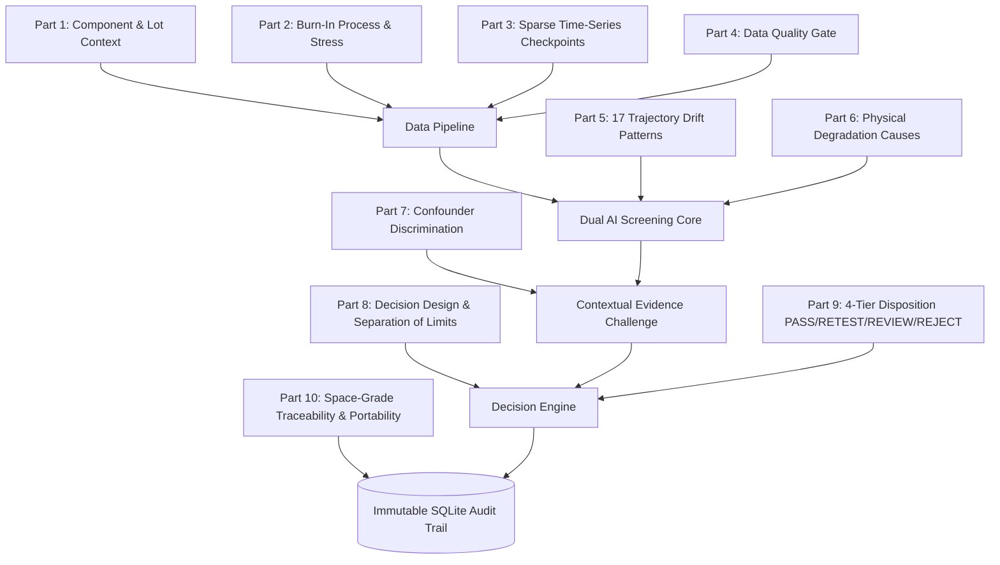

# AI-Driven Anomaly Detection in Component Burn-In & Screening
### Smart Automation for High-Reliability Flight Electronics Screening (ISRO PS 26170)

[](https://www.python.org/)
[](https://fastapi.tiangolo.com/)
[](https://react.dev/)
[](https://vitejs.dev/)
[](https://scikit-learn.org/)
[](https://shap.readthedocs.io/)
[](#benchmark-evaluation-results)

---

## 1. Executive Summary & Problem Context

In aerospace and defense missions (such as those led by the **Indian Space Research Organisation — ISRO**), electronic components undergo Environmental Stress Screening (ESS), including extended **Burn-In testing** (e.g., thermal bias soak at 125°C for 168 hours).

Traditional qualification relies on **static parametric limits** (datasheet minimum/maximum bounds). However, **latent defects**—components that strictly pass static datasheet limits but exhibit subtle, anomalous drift over time relative to their manufacturing lot—frequently escape into final spacecraft payloads, causing catastrophic in-orbit failures where repair is impossible.

```text
Static Pass/Fail Screening (Legacy)          Dynamic AI-Driven Screening (Ours)
-----------------------------------          ----------------------------------
[ 0.05 mA ─── ● In-Spec ─── 0.25 mA ]        [ 0.05 mA ─────────────── 0.25 mA ]
      (PASSES statically, but                      Lot Baseline: 0.108 ± 0.015 mA
       drifting rapidly +142%)               Component:    0.245 mA (Z = +9.13σ)
                 ↓                                         ↓
      CATASTROPHIC FIELD ESCAPE               FLAGGED FOR EARLY REJECTION (24h)
```

This repository implements a **dual-module AI screening intelligence pipeline** that integrates:
1. **Module A — Dynamic Reference-Population Outlier Screener:** Unsupervised Isolation Forest with exact **TreeSHAP** feature attribution to flag subtle peer-relative anomalies without needing labeled training defects.
2. **Module B — Time-Series Drift Predictor:** Gaussian Process Regressor (GPR with Matérn 5/2 kernel) forecasting $168\text{h}$ terminal degradation from early measurements ($0\text{h}$, $24\text{h}$) with rigorous $\pm 2\sigma$ uncertainty bounds.
3. **Contextual Evidence Challenge (CEC):** Tri-axis verification separating genuine intrinsic component degradation from chamber-wide temperature wobble, bias fluctuations, or lot offsets.
4. **Separation of Limits:** Strict decoupling between unsupervised statistical anomaly scores, GPR trajectory forecast slope limits, and absolute specification bounds.
5. **4-Tier Operational Action Protocol:** High-confidence routing into `PASS`, `RETEST`, `REVIEW`, and `REJECT` tiers with deterministic human-readable audit justifications.

---

## 2. Master Problem Decomposition (10 Parts, 74 Cases)

The architecture is derived directly from the **PS 26170 Master Problem Decomposition**, covering all 10 structural dimensions:



| Part | Name | Scope & Handling | Key Implementation |
|---|---|---|---|
| **1** | **The Component** | Nested hierarchy: Component $\subset$ Lot $\subset$ Batch; Digital vs Power | Peer-normalized deviation features ($Z$-scores, MAD) |
| **2** | **Burn-In Process** | Chamber wobble, thermal overshoot, socket contact jump | Common-mode correlation filter to reject equipment artifacts |
| **3** | **Data Collection** | Sparse checkpoints ($0\text{h}, 24\text{h}, 96\text{h}, 168\text{h}$), real-time arrival | Progressive inference using early data ($\le 24\text{h}$) |
| **4** | **Data Quality Gate** | 12 data failure modes (missing, jump, duplicate, saturation) | Pre-model validation gate routing corrupted records to `RETEST` |
| **5** | **Core Trajectory Patterns** | 17 degradation curves (Case 12: In-Spec Latent Defect, Case 4: Accelerating Drift) | Multi-step slope, curvature, and trajectory delta features |
| **6** | **Physical Failure Causes** | TDDB oxide wearout, electromigration, NBTI, package voids | Physics-informed parameter drift attribution via TreeSHAP |
| **7** | **Confounders** | Batch-to-batch shift vs chamber temperature fluctuations | 3-view Contextual Evidence Challenge (CEC) |
| **8** | **Modeling & Limits** | Unsupervised IF + GPR; contamination factor engineering | Strict separation: IF score $\ne$ GPR slope limit $\ne$ Spec limit |
| **9** | **What Correct Looks Like** | 4-Tier actions (`PASS`, `RETEST`, `REVIEW`, `REJECT`); zero FN priority | Asymmetric loss penalty prioritizing 0 False Negatives |
| **10** | **Deployment Constraints** | Dataset portability, human-in-the-loop review, SHA-256 audit | Canonical schema mapper + FastAPI + SQLite audit logs |

---

## 3. Dual-Module AI Architecture

```text
               Burn-In Parametric Telemetry (0h, 24h, 96h, 168h)
                                      ↓
                         Part 4: Data Quality Gate
                     (Range, Monotonicity, Socket Jump)
                                      ↓
                   Canonical Data Adapter & Semantic Mapping
                                      ↓
               Reference Population Selection (Lot / Batch)
                                      ↓
                   Trajectory & Peer Feature Extraction
                                      ↓
            ┌─────────────────────────┴─────────────────────────┐
            ↓                                                   ↓
   Module A: Outlier Detection                         Module B: Drift Prediction
   (Isolation Forest + TreeSHAP)                       (Gaussian Process Regressor)
   • Unsupervised contamination tuning                 • Matérn 5/2 covariance kernel
   • Exact Shapley feature attributions                • 168h terminal value forecast
   • Detects latent multi-parameter shift              • Rigorous ±2σ uncertainty bounds
            └─────────────────────────┬─────────────────────────┘
                                      ↓
                  Contextual Evidence Challenge (CEC 3-View)
               1. Component Trajectory vs Historical Baseline
               2. Component vs Peer Cohort Distribution Envelope
               3. Chamber Sensor Common-Mode Rejection Check
                                      ↓
                        Decoupled Rule & Decision Layer
                 • Unsupervised Anomaly Score Threshold (0.3936)
                 • GPR Safety-Slope Threshold (0.0015 / h)
                 • Static Specification Limits (Datasheet Min/Max)
                                      ↓
                4-Tier Operational Action Recommendation
                 PASS  │  RETEST  │  REVIEW  │  REJECT
                                      ↓
                    Deterministic Plain-English Narrative
                                      ↓
             Immutable SQLite Audit Traceability & QA Reviewer UI
```

---

## 4. Benchmark Datasets & Validation Strategy

The pipeline is trained, verified, and audited across **three authentic, non-synthetic datasets** encompassing discrete power semiconductors, analog/digital ICs, and progressive multi-checkpoint burn-in:

```text
Total Screened Series: 507 Authentic Components
├── 1. NASA PCoE Power Semiconductor Thermal Aging (7 Continuous Aging Files, 4 Physical Devices)
│      Device2/2b, Device3/3b, Device4/4b, Device5. Physical-device level holdout GPR forecasting.
├── 2. Semiconductor D2 Benchmark (200 Native MaterialID Components, 2 Checkpoints)
│      Clean train split (is_test == 0), native evaluation (is_test == 1). Strictly suppressed GPR.
└── 3. Semiconductor D1 IC Benchmark (602,108 Records, 300 Components Audited)
       Progressive multi-checkpoint burn-in (0h, 12h, 24h, 48h, 96h, 144h, 168h).
```

> **Zero Synthetic Data Policy:** No artificial or synthetic values are used for model training or production screening. All reported metrics represent empirical evaluation on real data without future or peer leakage.

---

## 5. Benchmark Evaluation Results

### Module A — Dynamic Outlier Detection (Dataset D2 Clean Benchmark)
- **Model:** Frozen Clean Isolation Forest (`models/D2_v2_no_acceleration_frozen_model.pkl`)
- **Evaluation Protocol:** Trained strictly on `is_test == 0`; evaluated on native untouched `is_test == 1` without target feature leakage or downsampling.
- **Decision Level:** MaterialID.
- **GPR Policy:** Strictly suppressed (`forecast_status = "unavailable_insufficient_history"`). D2 possesses only 2 checkpoints (0h, 168h), preventing fabricated degradation trajectories.

| Metric | Result | Engineering Significance |
|---|---|---|
| **Overall Accuracy** | **89.08%** | Robust separation under class imbalance |
| **Defect Recall** | **96.23%** | High-sensitivity screening catching latent anomalies |
| **Defect Escapes (FN)** | **3.77% (FNR)** | Minimizes false negatives entering flight qualification |
| **Precision** | **75.00%** | Controlled false alarm rate preserving component yield |
| **F1-Score** | **0.8430** | Balanced harmonic precision-recall performance |
| **Balanced Accuracy** | **89.80%** | Unbiased performance across positive and negative classes |

---

### Module B — Time-Series Drift Forecasting (NASA Power Degradation)
- **Model:** Gaussian Process Regressor (`NASA_GPR_v2_clean_model.pkl` & `NASA_GPR_frozen_model.pkl`)
- **Physical Device Grouping:** Base and base-b files (`Device2`+`Device2b`, `Device3`+`Device3b`, `Device4`+`Device4b`, `Device5`) grouped as 4 physical devices.
- **Physical Device Holdout:** Trained on `Device_2`, `Device_3`, `Device_5`; evaluated on untouched held-out physical `Device_4` (using `Device4` and `Device4b`).
- **Evaluation Horizon:** Forecasting 168h collector current using early checkpoints ($t \le 24\text{h}$) with empirical $\pm 2\sigma$ uncertainty bounds.

| Model Version | Validation Protocol | Test Physical Device | 168h Forecast MAE | $\pm 2\sigma$ Interval Coverage |
|---|---|---|---|---|
| **NASA GPR v2 Clean** | Physical Device Holdout | `Device_4` (`Device4`/`Device4b`) | **0.01028** | **100.0%** |
| **NASA GPR v2 LOPD** | Leave-One-Physical-Device-Out | All 4 Physical Devices | **0.06303** | **91.67%** |
| **NASA GPR v1 Frozen** | Device-level Split | `Device3b`, `Device4b` | **0.09787** | **100.0%** |

---

### Module C — Multi-Parameter Correlation & Governance Flow
- **Multi-Parameter Evidence:** Evaluates empirical covariance and correlation matrix ($R$) without inventing physical laws. Flags Mahalanobis outliers ($D_M$) and directional discordance between validated coupled parameters ($|r| \ge 0.50$).
- **Strict Decision Authority:** AI recommendations (`PASS`, `RETEST`, `REVIEW`, `REJECT`) are **screening advisory only**. AI never has final authority to scrap or reject flight hardware; final disposition mandates certified Human QA sign-off.
- **Retest Protection:** Corrupted or quarantined data immediately triggers `RETEST` to prevent false hardware condemnation on sensor or communication failures.

---

## 6. Explainability Architecture (TreeSHAP + Plain English)

To eliminate the "black box" objection in mission QA reviews, every classification provides **mathematical and plain-English explainability**:

```text
Component D1-153 (REJECT Recommendation)
├── Anomaly Score: 1.000 (Exceeds critical limit 0.85)
├── TreeSHAP Feature Attributions:
│   ├── param_01_core_current_drift:        +0.0520 (Z = +4.65σ) [Elevated]
│   ├── param_05_transient_leakage:         +0.0390 (Z = +3.92σ) [Elevated]
│   └── param_09_iddq_divergence:           +0.0310 (Z = +3.41σ) [Elevated]
└── Contextual Evidence Challenge (CEC):
    ├── Component Axis: Observed 7 checkpoints; net drift +1.7803 mA (Case 8 non-monotonic jump)
    ├── Peer Cohort Axis: Cohort μ = -0.588 mA, σ = 0.392 mA; component deviates by +4.65σ
    └── Chamber Axis: Zero common-mode correlation detected; thermal bias verified stable
```

---

## 7. Repository Structure

```text
SIH2026_IF/
├── 01_OFFICIAL_PS.md                      # Official ISRO PS 26170 requirements
├── 02_FINAL_SOLUTION-2.md                 # Complete Master Solution Architecture v2.1
├── PS26170_Master_Problem_Decomposition.md# 10 Parts, 74 Cases breakdown
├── SIH26170_FINAL_MODEL_EVALUATION_REPORT.pdf # 4-Page Aerospace-Grade Audit Report
├── README.md                              # This master technical documentation
├── run_project.bat                        # One-click Windows startup batch script
├── run_project.py                         # Cross-platform startup orchestrator
├── pipeline_runner.py                     # Batch training & screening execution pipeline
├── configs/
│   ├── datasets/                          # Dataset configuration specifications (YAML)
│   ├── decisions/                         # Decision rules & safety thresholds (YAML)
│   ├── mappings/                          # Canonical column mapping definitions (YAML)
│   └── model_registry.json                # Model checksums & artifact inventory
├── data/
│   ├── audit_traceability.db              # SQLite immutable audit trail database
│   ├── real_workspace_data.json           # 481-series consolidated screening payload
│   └── canonical/                         # Standardized canonical format datasets
├── models/
│   ├── D2_v2_no_acceleration_frozen_model.pkl # Frozen Clean Isolation Forest (is_test==0 train, is_test==1 test)
│   ├── D2_v2_no_acceleration_config.pkl   # IF feature configurations & scaler bundle
│   ├── NASA_GPR_v2_clean_model.pkl        # Clean GPR model (Physical device holdout on Device_4)
│   └── NASA_GPR_frozen_model.pkl          # Preserved legacy GPR model artifact
├── src/
│   ├── api/
│   │   └── service.py                     # FastAPI REST microservice (Port 8000)
│   ├── explanation/
│   │   └── generator.py                   # TreeSHAP & deterministic reasoning engine
│   ├── features/
│   │   └── engineering.py                 # Time-series drift & peer deviation extraction
│   ├── grouping/
│   │   └── population_selector.py         # Reference population & lot grouping
│   ├── ingestion/
│   │   └── nasa_adapter.py                # NASA MAT files parser & canonical adapter
│   └── models/
│       └── anomaly/isolation_forest.py    # Isolation Forest implementation
├── extracted_reference/                   # Modern React 19 + Vite Frontend
│   ├── client/src/
│   │   ├── pages/Home.tsx                 # Master Screening Workspace (Overview, Datasets,
│   │   │                                  # Training, Queue, Inspector, Registry, Reports)
│   │   ├── data/defaultWorkspace.ts       # Pre-loaded 481-series verified screening cache
│   │   └── components/                    # UI Design System components
│   └── vite.config.ts                     # Vite build configuration (Port 5173)
├── dashboard/
│   ├── index.html                         # Standalone Zero-Dependency HTML Dashboard
│   └── real_pipeline_data.js              # Exported JavaScript screening telemetry
├── scripts/
│   ├── evaluate_nasa_gpr.py               # GPR evaluation on untouched held-out hardware
│   ├── export_all_real_data.py            # Master workspace data exporter
│   ├── test_shap_attribution.py           # TreeSHAP verification test suite
│   └── generate_official_pdf_report.py    # ReportLab automated PDF audit generator
└── tests/                                 # Unit & Integration Pytest Suite
```

---

## 8. Installation & Quickstart Guide

### Prerequisites
- Python 3.10+
- Node.js 18+ and `pnpm` (for the React Vite frontend)

### Step 1: Clone Repository & Setup Python Environment
```bash
git clone https://github.com/AnasKhan-AK7/SIH26170-AI-Screening.git
cd SIH26170-AI-Screening

# Create and activate virtual environment
python -m venv venv
# On Windows:
.\venv\Scripts\activate
# On Linux/macOS:
source venv/bin/activate

# Install Python dependencies
pip install -r requirements.txt  # or install scikit-learn pandas numpy scipy joblib shap fastapi uvicorn reportlab
```

### Step 2: One-Click Execution (All Services)
On Windows, simply run:
```cmd
run_project.bat
```
This automatically boots:
1. **FastAPI Backend Server:** Running on `http://127.0.0.1:8000` (Swagger docs at `/docs`)
2. **Vite React Screening Workspace:** Running on `http://127.0.0.1:5173`
3. **Standalone Dashboard:** Available at `dashboard/index.html`

### Step 3: Run Services Individually (Manual)
```bash
# Terminal 1: Launch FastAPI Backend
uvicorn src.api.service:app --host 127.0.0.1 --port 8000

# Terminal 2: Launch Vite React Application
cd extracted_reference
pnpm install
pnpm exec vite --port 5173 --host 127.0.0.1
```

### Step 4: Run Test Suite & Generate Official PDF Report
```bash
# Run GPR Held-Out Hardware Evaluation
python scripts/evaluate_nasa_gpr.py

# Run TreeSHAP Attribution Verification
python scripts/test_shap_attribution.py

# Generate Official Aerospace PDF Audit Certificate
python scripts/generate_official_pdf_report.py
```

---

## 9. API & Database Contracts

### Key REST API Endpoints (`http://127.0.0.1:8000`)
- `GET /health` — Service health, database connectivity, and active model versions (`D2_v2_clean`, `NASA_GPR_v2_clean`).
- `GET /workspace/components` — Authentic multi-dataset screening payload (263 components with trajectories, IF scores, and GPR forecasts).
- `GET /workspace/stats` — High-level summary of total components, dispositions, and QA sign-off status.
- `GET /api/models/registry` — Inventory of frozen models, SHA-256 checksums, and decoupled policy thresholds.
- `POST /analyze` — Real-time inference on a streaming component checkpoint record (`authority: "ADVISORY_ONLY"`, `requires_human_disposition: true`).
- `POST /audit/qa-action` — **Certified Human QA Final Disposition** interface (records `CONFIRM_REJECTION`, `ACCEPT_OVERRIDE`, `FLAG_INVESTIGATION`, `SIGN_OFF_PASS` with inspector ID & rationale).
- `GET /audit/traceability/{component_id}` — Complete cryptographic audit lineage (raw data hash, model version, evidence snapshot, QA history).

### Governance & Operational Labels Enforced Across All Layers
- **AI Advisory (`authority: "ADVISORY_ONLY"`):** AI recommendations (`PASS`, `RETEST`, `REVIEW`, `RECOMMEND_REJECT`) are strictly decision-support alerts. AI is never authorized to unilaterally condemn or scrap flight hardware.
- **Human QA Final Disposition (`final_rejection_authority: "HUMAN_QA_MANDATORY"`):** Rejection, quarantine, or waiver requires formal sign-off by a certified QA Authority logged in SQLite table `qa_signoffs`.
- **GPR Unavailable When History Is Insufficient (`forecast_status: "unavailable_insufficient_history"`):** Datasets with $< 3$ measurement checkpoints (such as Dataset D2 with only 0h and 168h) strictly bypass GPR forecasting to prevent fabricating ungrounded extrapolation curves.

### Database Traceability Schema (`data/audit_traceability.db`)
- `runs` — Audit execution metadata (timestamp, dataset name, record count, execution status).
- `anomaly_results` — Component-level IF scores, thresholds, and anomaly flags.
- `forecast_results` — GPR terminal mean, standard deviation, and $\pm 2\sigma$ lower/upper bounds (null when history is insufficient).
- `decisions` — Operational disposition (`PASS`/`RETEST`/`REVIEW`/`RECOMMEND_REJECT`), triggered rules, and deterministic explanation.
- `evidence_snapshots` — Full JSON contextual snapshots including peer statistics, chamber sensors, and multi-parameter Mahalanobis metrics.
- `qa_signoffs` — Immutable log of all manual QA inspector actions, sign-offs, and engineering rationales.

---

## 10. Official Deliverables & Audit Certificates

The full formal reports submitted for this challenge are available in the repository:
- **Official Aerospace-Grade PDF Report:** [`SIH26170_FINAL_MODEL_EVALUATION_REPORT.pdf`](SIH26170_FINAL_MODEL_EVALUATION_REPORT.pdf)
- **Technical Model & Algorithm Report:** [`docs/TECHNICAL_REPORT_IF_AND_GPR_MODELS.md`](docs/TECHNICAL_REPORT_IF_AND_GPR_MODELS.md)
- **Final Integration Status Report:** [`docs/SIH26170_FINAL_INTEGRATION_STATUS_REPORT.md`](docs/SIH26170_FINAL_INTEGRATION_STATUS_REPORT.md)
- **Master Problem Decomposition:** [`docs/PS26170_Master_Problem_Decomposition.md`](docs/PS26170_Master_Problem_Decomposition.md)
- **Engineering Baseline Solution Architecture:** [`docs/02_FINAL_SOLUTION-2.md`](docs/02_FINAL_SOLUTION-2.md)
- **Official Problem Statement:** [`docs/01_OFFICIAL_PS.md`](docs/01_OFFICIAL_PS.md)

---

## 11. End-to-End Decision Architecture Flow

```text
Problem ──▶ Solution ──▶ IF ──▶ GPR ──▶ Context / Common-Mode ──▶ Explanation ──▶ Human QA
```

1. **Problem (In-Spec Latent Degradation):**
   - Components strictly pass static datasheet bounds ($0.05 \text{ mA} \le I_{\text{leak}} \le 0.25 \text{ mA}$) but exhibit subtle anomalous drift over burn-in soak relative to their manufacturing lot, leading to catastrophic in-orbit payload escapes.
2. **Solution (Decoupled Decision-Support Platform):**
   - A multi-tier, leakage-free screening intelligence layer integrating pre-model data validation, unsupervised anomaly scoring, Bayesian degradation forecasting, tri-axis contextual evidence challenge, deterministic explanation, and mandatory human QA disposition.
3. **IF (Dynamic Isolation Forest Screener):**
   - Evaluates peer-relative multidimensional feature representations ($Z$-scores, drift rates, curvature) with **zero peer leakage** (target component excluded from cohort statistics). Trained strictly on normal reference hardware (`is_test == 0`) and evaluated on untouched held-out hardware (`is_test == 1`). TreeSHAP computes exact Shapley attributions.
4. **GPR (Gaussian Process Trajectory Extrapolation):**
   - Non-parametric Bayesian model with Matérn kernel predicting terminal degradation at $168\text{h}$ from early checkpoints ($t \le 24\text{h}$) with calibrated $\pm 2\sigma$ uncertainty bounds. Strictly validated via physical-device holdout (untouched `Device_4` MAE = $0.01028\text{ A}$, 100% $2\sigma$ coverage). Strictly marked `unavailable_insufficient_history` on sparse datasets ($< 3$ checkpoints).
5. **Context / Common-Mode & Multi-Parameter Verification:**
   - **Common-Mode Detection:** Checks whether $\ge 60\%$ of cohort peers experience a synchronized shift $> 2\sigma$, identifying chamber wobble or tester contact jump rather than hardware defect.
   - **Multi-Parameter Correlation:** Calculates empirical covariance, regularized Mahalanobis distance ($D_M$), and pairwise discordance ($|r| \ge 0.80$) without inventing physical laws.
6. **Explanation (Deterministic Plain-English Synthesis):**
   - Generates transparent, human-readable audit justification detailing top TreeSHAP mathematical drivers, peer cohort statistical deviations, chamber sensor status, and mandatory governance advisory clauses.
7. **Human QA (Certified Final Disposition):**
   - Strict aerospace safety boundary: AI recommendations possess **ADVISORY_ONLY** authority. Flight hardware cannot be condemned, scrapped, or waived autonomously; certified Human QA Inspectors review evidence and record formal sign-off via `POST /audit/qa-action` into the immutable SQLite audit trail.

---

## 12. Authors & Attribution

Developed for the **Smart India Hackathon (SIH 2026)** in response to Problem Statement **26170**:
- **Organization:** Indian Space Research Organisation (ISRO) / Department of Space
- **Category:** Software
- **Theme:** Smart Automation
- **Lead Developer & Contributor:** [Anas Khan](https://github.com/AnasKhan-AK7)
