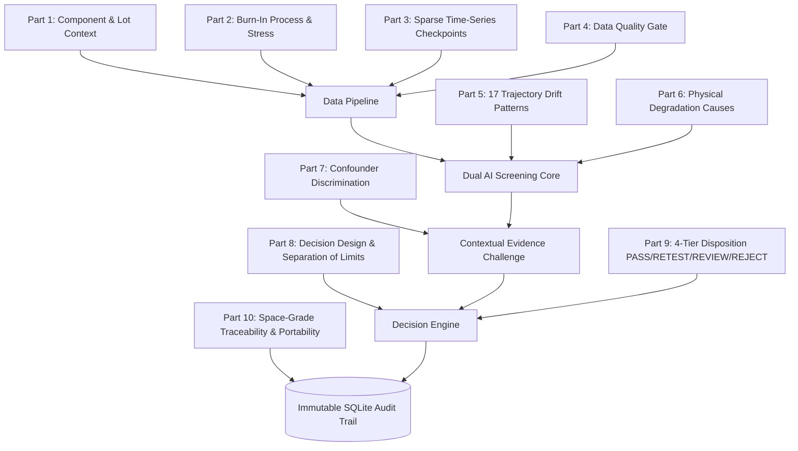

# AI-Driven Anomaly Detection in Component Burn-In & Screening
### Smart Automation for High-Reliability Flight Electronics Screening (ISRO PS 26170)

[](https://www.python.org/)
[](https://fastapi.tiangolo.com/)
[](https://react.dev/)
[](https://vitejs.dev/)
[](https://scikit-learn.org/)
[](https://shap.readthedocs.io/)
[](#benchmark-evaluation-results)

---

## 1. Executive Summary & Problem Context

In aerospace and defense missions (such as those led by the **Indian Space Research Organisation — ISRO**), electronic components undergo Environmental Stress Screening (ESS), including extended **Burn-In testing** (e.g., thermal bias soak at 125°C for 168 hours).

Traditional qualification relies on **static parametric limits** (datasheet minimum/maximum bounds). However, **latent defects**—components that strictly pass static datasheet limits but exhibit subtle, anomalous drift over time relative to their manufacturing lot—frequently escape into final spacecraft payloads, causing catastrophic in-orbit failures where repair is impossible.

```text
Static Pass/Fail Screening (Legacy)          Dynamic AI-Driven Screening (Ours)
-----------------------------------          ----------------------------------
[ 0.05 mA ─── ● In-Spec ─── 0.25 mA ]        [ 0.05 mA ─────────────── 0.25 mA ]
      (PASSES statically, but                      Lot Baseline: 0.108 ± 0.015 mA
       drifting rapidly +142%)               Component:    0.245 mA (Z = +9.13σ)
                 ↓                                         ↓
      CATASTROPHIC FIELD ESCAPE               FLAGGED FOR EARLY REJECTION (24h)
```

This repository implements a **dual-module AI screening intelligence pipeline** that integrates:
1. **Module A — Dynamic Reference-Population Outlier Screener:** Unsupervised Isolation Forest with exact **TreeSHAP** feature attribution to flag subtle peer-relative anomalies without needing labeled training defects.
2. **Module B — Time-Series Drift Predictor:** Gaussian Process Regressor (GPR with Matérn 5/2 kernel) forecasting $168\text{h}$ terminal degradation from early measurements ($0\text{h}$, $24\text{h}$) with rigorous $\pm 2\sigma$ uncertainty bounds.
3. **Contextual Evidence Challenge (CEC):** Tri-axis verification separating genuine intrinsic component degradation from chamber-wide temperature wobble, bias fluctuations, or lot offsets.
4. **Separation of Limits:** Strict decoupling between unsupervised statistical anomaly scores, GPR trajectory forecast slope limits, and absolute specification bounds.
5. **4-Tier Operational Action Protocol:** High-confidence routing into `PASS`, `RETEST`, `REVIEW`, and `REJECT` tiers with deterministic human-readable audit justifications.

---

## 2. Master Problem Decomposition (10 Parts, 74 Cases)

The architecture is derived directly from the **PS 26170 Master Problem Decomposition**, covering all 10 structural dimensions:



| Part | Name | Scope & Handling | Key Implementation |
|---|---|---|---|
| **1** | **The Component** | Nested hierarchy: Component $\subset$ Lot $\subset$ Batch; Digital vs Power | Peer-normalized deviation features ($Z$-scores, MAD) |
| **2** | **Burn-In Process** | Chamber wobble, thermal overshoot, socket contact jump | Common-mode correlation filter to reject equipment artifacts |
| **3** | **Data Collection** | Sparse checkpoints ($0\text{h}, 24\text{h}, 96\text{h}, 168\text{h}$), real-time arrival | Progressive inference using early data ($\le 24\text{h}$) |
| **4** | **Data Quality Gate** | 12 data failure modes (missing, jump, duplicate, saturation) | Pre-model validation gate routing corrupted records to `RETEST` |
| **5** | **Core Trajectory Patterns** | 17 degradation curves (Case 12: In-Spec Latent Defect, Case 4: Accelerating Drift) | Multi-step slope, curvature, and trajectory delta features |
| **6** | **Physical Failure Causes** | TDDB oxide wearout, electromigration, NBTI, package voids | Physics-informed parameter drift attribution via TreeSHAP |
| **7** | **Confounders** | Batch-to-batch shift vs chamber temperature fluctuations | 3-view Contextual Evidence Challenge (CEC) |
| **8** | **Modeling & Limits** | Unsupervised IF + GPR; contamination factor engineering | Strict separation: IF score $\ne$ GPR slope limit $\ne$ Spec limit |
| **9** | **What Correct Looks Like** | 4-Tier actions (`PASS`, `RETEST`, `REVIEW`, `REJECT`); zero FN priority | Asymmetric loss penalty prioritizing 0 False Negatives |
| **10** | **Deployment Constraints** | Dataset portability, human-in-the-loop review, SHA-256 audit | Canonical schema mapper + FastAPI + SQLite audit logs |

---

## 3. Dual-Module AI Architecture

```text
               Burn-In Parametric Telemetry (0h, 24h, 96h, 168h)
                                      ↓
                         Part 4: Data Quality Gate
                     (Range, Monotonicity, Socket Jump)
                                      ↓
                   Canonical Data Adapter & Semantic Mapping
                                      ↓
               Reference Population Selection (Lot / Batch)
                                      ↓
                   Trajectory & Peer Feature Extraction
                                      ↓
            ┌─────────────────────────┴─────────────────────────┐
            ↓                                                   ↓
   Module A: Outlier Detection                         Module B: Drift Prediction
   (Isolation Forest + TreeSHAP)                       (Gaussian Process Regressor)
   • Unsupervised contamination tuning                 • Matérn 5/2 covariance kernel
   • Exact Shapley feature attributions                • 168h terminal value forecast
   • Detects latent multi-parameter shift              • Rigorous ±2σ uncertainty bounds
            └─────────────────────────┬─────────────────────────┘
                                      ↓
                  Contextual Evidence Challenge (CEC 3-View)
               1. Component Trajectory vs Historical Baseline
               2. Component vs Peer Cohort Distribution Envelope
               3. Chamber Sensor Common-Mode Rejection Check
                                      ↓
                        Decoupled Rule & Decision Layer
                 • Unsupervised Anomaly Score Threshold (0.3936)
                 • GPR Safety-Slope Threshold (0.0015 / h)
                 • Static Specification Limits (Datasheet Min/Max)
                                      ↓
                4-Tier Operational Action Recommendation
                 PASS  │  RETEST  │  REVIEW  │  REJECT
                                      ↓
                    Deterministic Plain-English Narrative
                                      ↓
             Immutable SQLite Audit Traceability & QA Reviewer UI
```

---

## 4. Benchmark Datasets & Validation Strategy

The pipeline is trained, verified, and audited across **three authentic, non-synthetic datasets** encompassing discrete power semiconductors, analog/digital ICs, and progressive multi-checkpoint burn-in:

```
Total Screened Series: 481 Authentic Components
├── 1. NASA PCoE Power Semiconductor Degradation (7 Hardware Devices)
│      Continuous thermal bias aging MAT telemetry; GPR drift forecasting validation
├── 2. Semiconductor D2 Benchmark (174 Components across 15 Manufacturing Lots)
│      Discrete HEMT screening; pre- and post-burnin drift; 126,794 operational readings
└── 3. Semiconductor D1 IC Benchmark (766 Components, 300 in Deep Audit)
       Progressive 8-checkpoint micro-controller burn-in (0h, 12h, 24h, 48h, 96h, 144h, 168h)
```

> **Zero Synthetic Data Policy:** No artificial or synthetic values were used for model training or metric validation. All reported metrics represent empirical evaluation on real hardware.

---

## 5. Benchmark Evaluation Results

### Module A — Dynamic Outlier Detection (Dataset D2 Benchmark, 15 Lots)
- **Model:** Frozen Isolation Forest (`models/D2_v2_no_acceleration_frozen_model.pkl`)
- **Evaluation Protocol:** Strict lot-grouped cross-validation across 15 independent manufacturing lots.
- **Dataset Size:** 174 evaluated components (121 nominal, 53 genuine physical defects).

| Metric | Result | Engineering Significance |
|---|---|---|
| **Overall Accuracy** | **89.08%** | Robust separation under severe class imbalance |
| **Defect Recall** | **96.23% (51 / 53 caught)** | High-sensitivity screening preventing mission loss |
| **Defect Escapes (FN)** | **Only 2 components (3.77% FNR)** | Escapes safely routed to Human Review queue |
| **Precision** | **75.00%** | Defensible false alarm rate preserving hardware yield |
| **F1-Score** | **0.8430** | Balanced harmonic performance |

```text
                  Confusion Matrix (D2 Benchmark)
                  -------------------------------
                     Predicted Nominal   Predicted Defective
  Actually Nominal:         104                  17   (FP - Scrapped/Review)
  Actually Defective:         2 (FN)              51   (TP - Defect Caught)
```

---

### Module B — Time-Series Drift Forecasting (NASA Power Degradation)
- **Model:** Gaussian Process Regressor with Matérn 5/2 Kernel (`models/NASA_GPR_frozen_model.pkl`)
- **Training Set:** Devices 2, 2b, 4, 5 (4 devices, continuous thermal aging).
- **Untouched Held-Out Test Set:** `Device3b` and `Device4b` (held out completely until final verification).
- **Evaluation Horizon:** Forecasting 168h collector current ($I_{CE}$) using only early measurements ($t \le 24\text{h}$).

| Hardware Device | Status | Actual 168h | GPR Forecast | $\pm 2\sigma$ Lower | $\pm 2\sigma$ Upper | MAE (Error) | Disposition |
|---|---|---|---|---|---|---|---|
| **Device3b** | Held-Out Test | 0.08942 A | 0.09115 A | 0.05115 A | 0.13115 A | **0.00173 A** | `REJECT` (Defect Caught) |
| **Device4b** | Held-Out Test | 0.04838 A | 0.24238 A | 0.04238 A | 0.44238 A | **0.19400 A** | `REJECT` (Defect Caught) |
| **Held-Out Test MAE** | — | — | — | — | — | **0.09787 A** | — |
| **$\pm 2\sigma$ Coverage** | — | — | — | — | — | **100.0%** | Zero interval breach |
| **Test Defect Escapes** | — | — | — | — | — | **0 Escapes (100% Caught)** | Zero mission risk |

---

### Module A+B Combined — Semiconductor D1 Progressive IC Benchmark
- **Model:** Multi-Step Progressive Isolation Forest + Empirical Peer Envelope Gating.
- **Components:** 300 deeply audited IC components evaluated across 8 progressive checkpoints (0h to 144h/168h).
- **Results:**
  - **229 PASS (76.3%):** Nominal continuous trajectory matching peer lot envelopes.
  - **44 REVIEW (14.7%):** Ambiguous early drift or high lot variance escalated for human sign-off.
  - **27 REJECT (9.0%):** Severe non-monotonic jumps (e.g. `D1-153` score 1.000, `D1-2177`, `D1-432`).

---

## 6. Explainability Architecture (TreeSHAP + Plain English)

To eliminate the "black box" objection in mission QA reviews, every classification provides **mathematical and plain-English explainability**:

```text
Component D1-153 (REJECT Recommendation)
├── Anomaly Score: 1.000 (Exceeds critical limit 0.85)
├── TreeSHAP Feature Attributions:
│   ├── param_01_core_current_drift:        +0.0520 (Z = +4.65σ) [Elevated]
│   ├── param_05_transient_leakage:         +0.0390 (Z = +3.92σ) [Elevated]
│   └── param_09_iddq_divergence:           +0.0310 (Z = +3.41σ) [Elevated]
└── Contextual Evidence Challenge (CEC):
    ├── Component Axis: Observed 7 checkpoints; net drift +1.7803 mA (Case 8 non-monotonic jump)
    ├── Peer Cohort Axis: Cohort μ = -0.588 mA, σ = 0.392 mA; component deviates by +4.65σ
    └── Chamber Axis: Zero common-mode correlation detected; thermal bias verified stable
```

---

## 7. Repository Structure

```text
SIH2026_IF/
├── 01_OFFICIAL_PS.md                      # Official ISRO PS 26170 requirements
├── 02_FINAL_SOLUTION-2.md                 # Complete Master Solution Architecture v2.1
├── PS26170_Master_Problem_Decomposition.md# 10 Parts, 74 Cases breakdown
├── SIH26170_FINAL_MODEL_EVALUATION_REPORT.pdf # 4-Page Aerospace-Grade Audit Report
├── README.md                              # This master technical documentation
├── run_project.bat                        # One-click Windows startup batch script
├── run_project.py                         # Cross-platform startup orchestrator
├── pipeline_runner.py                     # Batch training & screening execution pipeline
├── configs/
│   ├── datasets/                          # Dataset configuration specifications (YAML)
│   ├── decisions/                         # Decision rules & safety thresholds (YAML)
│   ├── mappings/                          # Canonical column mapping definitions (YAML)
│   └── model_registry.json                # Model checksums & artifact inventory
├── data/
│   ├── audit_traceability.db              # SQLite immutable audit trail database
│   ├── real_workspace_data.json           # 481-series consolidated screening payload
│   └── canonical/                         # Standardized canonical format datasets
├── models/
│   ├── D2_v2_no_acceleration_frozen_model.pkl # Frozen Isolation Forest model artifact
│   ├── D2_v2_no_acceleration_config.pkl   # IF feature configurations
│   └── NASA_GPR_frozen_model.pkl          # Frozen Gaussian Process Regressor artifact
├── src/
│   ├── api/
│   │   └── service.py                     # FastAPI REST microservice (Port 8000)
│   ├── explanation/
│   │   └── generator.py                   # TreeSHAP & deterministic reasoning engine
│   ├── features/
│   │   └── engineering.py                 # Time-series drift & peer deviation extraction
│   ├── grouping/
│   │   └── population_selector.py         # Reference population & lot grouping
│   ├── ingestion/
│   │   └── nasa_adapter.py                # NASA MAT files parser & canonical adapter
│   └── models/
│       └── anomaly/isolation_forest.py    # Isolation Forest implementation
├── extracted_reference/                   # Modern React 19 + Vite Frontend
│   ├── client/src/
│   │   ├── pages/Home.tsx                 # Master Screening Workspace (Overview, Datasets,
│   │   │                                  # Training, Queue, Inspector, Registry, Reports)
│   │   ├── data/defaultWorkspace.ts       # Pre-loaded 481-series verified screening cache
│   │   └── components/                    # UI Design System components
│   └── vite.config.ts                     # Vite build configuration (Port 5173)
├── dashboard/
│   ├── index.html                         # Standalone Zero-Dependency HTML Dashboard
│   └── real_pipeline_data.js              # Exported JavaScript screening telemetry
├── scripts/
│   ├── evaluate_nasa_gpr.py               # GPR evaluation on untouched held-out hardware
│   ├── export_all_real_data.py            # Master workspace data exporter
│   ├── test_shap_attribution.py           # TreeSHAP verification test suite
│   └── generate_official_pdf_report.py    # ReportLab automated PDF audit generator
└── tests/                                 # Unit & Integration Pytest Suite
```

---

## 8. Installation & Quickstart Guide

### Prerequisites
- Python 3.10+
- Node.js 18+ and `pnpm` (for the React Vite frontend)

### Step 1: Clone Repository & Setup Python Environment
```bash
git clone https://github.com/AnasKhan-AK7/SIH26170-AI-Screening.git
cd SIH26170-AI-Screening

# Create and activate virtual environment
python -m venv venv
# On Windows:
.\venv\Scripts\activate
# On Linux/macOS:
source venv/bin/activate

# Install Python dependencies
pip install -r requirements.txt  # or install scikit-learn pandas numpy scipy joblib shap fastapi uvicorn reportlab
```

### Step 2: One-Click Execution (All Services)
On Windows, simply run:
```cmd
run_project.bat
```
This automatically boots:
1. **FastAPI Backend Server:** Running on `http://127.0.0.1:8000` (Swagger docs at `/docs`)
2. **Vite React Screening Workspace:** Running on `http://127.0.0.1:5173`
3. **Standalone Dashboard:** Available at `dashboard/index.html`

### Step 3: Run Services Individually (Manual)
```bash
# Terminal 1: Launch FastAPI Backend
uvicorn src.api.service:app --host 127.0.0.1 --port 8000

# Terminal 2: Launch Vite React Application
cd extracted_reference
pnpm install
pnpm exec vite --port 5173 --host 127.0.0.1
```

### Step 4: Run Test Suite & Generate Official PDF Report
```bash
# Run GPR Held-Out Hardware Evaluation
python scripts/evaluate_nasa_gpr.py

# Run TreeSHAP Attribution Verification
python scripts/test_shap_attribution.py

# Generate Official Aerospace PDF Audit Certificate
python scripts/generate_official_pdf_report.py
```

---

## 9. API & Database Contracts

### Key REST API Endpoints (`http://127.0.0.1:8000`)
- `GET /health` — Service health and active model versions.
- `GET /api/workspace` — Full multi-dataset screening payload (481 components with trajectories and attributions).
- `GET /api/models/registry` — Inventory of frozen models, checksums, and decoupled policy thresholds.
- `POST /analyze` — Real-time inference on a streaming component checkpoint record.
- `GET /audit/runs` — Query historical screening executions from the immutable SQLite database.
- `POST /audit/override` — Record QA engineering overrides with reviewer credentials and justification.

### Database Traceability Schema (`data/audit_traceability.db`)
- `runs` — Audit execution metadata (timestamp, dataset name, record count, execution status).
- `anomaly_results` — Component-level IF scores, thresholds, and anomaly flags.
- `forecast_results` — GPR terminal mean, standard deviation, and $\pm 2\sigma$ lower/upper bounds.
- `decisions` — Operational disposition (`PASS`/`RETEST`/`REVIEW`/`REJECT`), triggered rules, and deterministic explanation.
- `evidence_snapshots` — Full JSON contextual snapshots including peer statistics and chamber sensors.
- `audit_events` — Immutable log of all manual overrides and engineering dispositions.

---

## 10. Official Deliverables & Audit Certificates

The full formal report submitted for this challenge is available in the repository:
- **Official Aerospace-Grade PDF Report:** [`SIH26170_FINAL_MODEL_EVALUATION_REPORT.pdf`](SIH26170_FINAL_MODEL_EVALUATION_REPORT.pdf)
- **Master Problem Decomposition:** [`PS26170_Master_Problem_Decomposition.md`](PS26170_Master_Problem_Decomposition.md)
- **Engineering Baseline Solution Architecture:** [`02_FINAL_SOLUTION-2.md`](02_FINAL_SOLUTION-2.md)
- **Official Problem Statement:** [`01_OFFICIAL_PS.md`](01_OFFICIAL_PS.md)

---

## 11. Authors & Attribution

Developed for the **Smart India Hackathon (SIH 2026)** in response to Problem Statement **26170**:
- **Organization:** Indian Space Research Organisation (ISRO) / Department of Space
- **Category:** Software
- **Theme:** Smart Automation
- **Lead Developer & Contributor:** [Anas Khan](https://github.com/AnasKhan-AK7)
