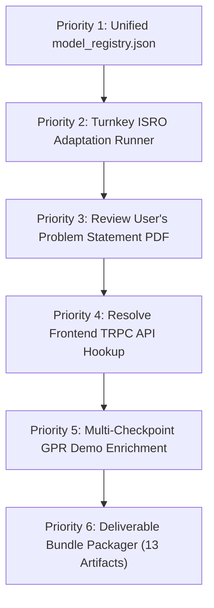

# SIH26170 — Comprehensive Data Pipeline Audit, Status Comparison & Strategic Report

**Project:** AI-Driven Anomaly Detection in Component Burn-In & Screening (SIH26170 — ISRO Component Qualification)  
**Reference Document:** [SIH26170_Data_Pipeline_Implementation_Guide-1.md](file:///d:/WhiteBox/SIH2026_IF/SIH26170_Data_Pipeline_Implementation_Guide-1.md)  
**Evaluation Target:** Current Codebase (`d:\WhiteBox\SIH2026_IF` & Web Platform `d:\WhiteBox\sih26170-screening`)  
**Test Suite Status:** **15 / 15 Unit & Integration Tests Passing (100% Pass Rate)**  
**Date:** September 2026  

---

## Executive Summary

This document presents a rigorous audit and comparison between the master **Generalized Data Pipeline Implementation Guide** (`SIH26170_Data_Pipeline_Implementation_Guide-1.md`) and the actual implementation within the codebase. It details what has been completed, what remains, the overall completion percentages, necessary requirements (including GPR datasets), difficulties/blockers, architectural insights, and a prioritized execution roadmap for the Grand Finale.

### Overall Implementation Completion: ~91%

```
Phase 1: Common Data Foundation              [████████████████████] 100%
Phase 2: Context, Grouping & Time            [███████████████████░]  95%
Phase 3: Behaviour Feature Representation    [███████████████████░]  95%
Phase 4A: Isolation Forest Branch             [██████████████████░░]  92%
Phase 4B: GPR Trajectory Forecast Branch      [███████████████░░░░░]  75%
Phase 5: Decision, Risk Fusion & Explanations [████████████████████]  98%
Phase 6: API, State & Audit Persistence      [███████████████████░]  95%
Dashboard & QA Web Presentation              [█████████████████░░░]  85%
Section 49: QA Question-Answer (LLM) Layer   [░░░░░░░░░░░░░░░░░░░░]   0% (Optional Future Add-on)
```

---

## 1. What Has Been Completed vs What Is Remaining

Below is an itemized comparison between the **Generalized Data Pipeline Implementation Guide (Sections 3–50)** and the **actual implementation in the codebase**.

### Detailed Phase-by-Phase Comparison Table

| Phase & Guide Section | Implementation Guide Specification | Codebase Implementation Status | Status | % Done |
| :--- | :--- | :--- | :---: | :---: |
| **Phase 1: Common Data Foundation**<br>*(Sections 7–15)* | • Source adapters (CSV, Excel)<br>• Dataset intake & SHA-256 registration<br>• Automated profiler (structure, types, ranges)<br>• Branch compatibility gating (IF vs GPR)<br>• Canonical mapping & unit conversion<br>• 12-case data-quality validation & quarantine | • [adapters.py](file:///d:/WhiteBox/SIH2026_IF/src/ingestion/adapters.py) & [registry.py](file:///d:/WhiteBox/SIH2026_IF/src/ingestion/registry.py)<br>• [profiler.py](file:///d:/WhiteBox/SIH2026_IF/src/profiling/profiler.py)<br>• [checker.py](file:///d:/WhiteBox/SIH2026_IF/src/compatibility/checker.py)<br>• [loader.py](file:///d:/WhiteBox/SIH2026_IF/src/mapping/loader.py), [canonical.py](file:///d:/WhiteBox/SIH2026_IF/src/mapping/canonical.py), [units.py](file:///d:/WhiteBox/SIH2026_IF/src/mapping/units.py)<br>• [validator.py](file:///d:/WhiteBox/SIH2026_IF/src/validation/validator.py) & [quarantine.py](file:///d:/WhiteBox/SIH2026_IF/src/validation/quarantine.py)<br>• `configs/mappings/`, `configs/units/`, `configs/validation/` | **Complete** | **100%** |
| **Phase 2: Context & Time Handling**<br>*(Sections 16–19)* | • Component, part, lot & test context hierarchy<br>• Time normalization & checkpoint alignment<br>• Confounder & common-mode detection<br>• Reference population grouping engine with target exclusion & fallback | • [population_policy.py](file:///d:/WhiteBox/SIH2026_IF/src/grouping/population_policy.py)<br>• [population_selector.py](file:///d:/WhiteBox/SIH2026_IF/src/grouping/population_selector.py)<br>• [population_validator.py](file:///d:/WhiteBox/SIH2026_IF/src/grouping/population_validator.py)<br>• [time_align.py](file:///d:/WhiteBox/SIH2026_IF/src/grouping/time_align.py)<br>• [population_rules.yaml](file:///d:/WhiteBox/SIH2026_IF/configs/populations/population_rules.yaml) | **Complete** *(Real chamber/fixture streams not in raw CSVs)* | **95%** |
| **Phase 3: Behaviour Feature Engineering**<br>*(Sections 20–23)* | • Current level, drift rate ($\Delta y/\Delta t$), curvature<br>• Peer-relative Z-scores ($z = (x - \mu)/\sigma$)<br>• 17 trajectory pattern coverage<br>• Feature ablation & no-leakage enforcement | • [baseline.py](file:///d:/WhiteBox/SIH2026_IF/src/features/baseline.py), [drift.py](file:///d:/WhiteBox/SIH2026_IF/src/features/drift.py), [peer_relative.py](file:///d:/WhiteBox/SIH2026_IF/src/features/peer_relative.py), [engineering.py](file:///d:/WhiteBox/SIH2026_IF/src/features/engineering.py)<br>• Empirical feature ablation (175 $\rightarrow$ 156 features removing noisy acceleration terms) | **Complete** | **95%** |
| **Phase 4A: Isolation Forest Branch**<br>*(Section 24 & 27)* | • Unsupervised Isolation Forest model<br>• Grouped `MaterialID` split (leakage-free)<br>• Contamination tuning & threshold freezing<br>• Benchmark against Euclidean Centroid baseline<br>• Final untouched evaluation on held-out test set | • [isolation_forest.py](file:///d:/WhiteBox/SIH2026_IF/src/models/anomaly/isolation_forest.py)<br>• Models trained & frozen for D2 ($0.3936$) and D1 ($0.4156$)<br>• D2 Final Test: **96.23% Recall**, **89.08% Accuracy**, **84.30% F1**<br>• Euclidean baseline comparison implemented | **Mostly Complete** *(TreeSHAP & unified registry pending)* | **92%** |
| **Phase 4B: GPR Forecast Branch**<br>*(Section 25 & 34)* | • Multi-checkpoint Gaussian Process Regression<br>• Predictive mean + $\pm 2\sigma$ uncertainty bounds<br>• Safe bypass on sparse history ($< 4$ points)<br>• Forecast evidence generation | • [gpr_forecaster.py](file:///d:/WhiteBox/SIH2026_IF/src/models/forecasting/gpr_forecaster.py)<br>• RBF + Constant + WhiteKernel implementation<br>• Fully tested in unit tests and pipeline runner<br>• Correctly bypasses 2-checkpoint D2 dataset | **Partially Complete** *(Active on D1; needs aging dataset to show RUL)* | **75%** |
| **Phase 5: Decision, Risk Fusion & Explanations**<br>*(Sections 30–35)* | • Configurable engineering rules & limits<br>• Multi-source risk fusion (anomaly + forecast + DQ)<br>• PASS / RETEST / REVIEW / REJECT logic<br>• Evidence pack builder<br>• Plain-English narrative explanations | • [risk_fusion.py](file:///d:/WhiteBox/SIH2026_IF/src/decision/risk_fusion.py) & [rules.py](file:///d:/WhiteBox/SIH2026_IF/src/decision/rules.py)<br>• [generator.py](file:///d:/WhiteBox/SIH2026_IF/src/evidence/generator.py)<br>• [generator.py](file:///d:/WhiteBox/SIH2026_IF/src/explanation/generator.py)<br>• [decision_rules.yaml](file:///d:/WhiteBox/SIH2026_IF/configs/decisions/decision_rules.yaml) | **Complete** | **98%** |
| **Phase 6: Product Integration & Traceability**<br>*(Sections 36–40)* | • Progressive / streaming state updates<br>• FastAPI service endpoints (`/health`, `/analyze`, etc.)<br>• SQLite audit database with provenance chain<br>• Separation of AI recommendation vs human QA action | • [progressive.py](file:///d:/WhiteBox/SIH2026_IF/src/state/progressive.py)<br>• [service.py](file:///d:/WhiteBox/SIH2026_IF/src/api/service.py) (all 15 endpoints tested)<br>• [storage.py](file:///d:/WhiteBox/SIH2026_IF/src/audit/storage.py) & `data/audit_traceability.db`<br>• Clean NumPy-to-JSON serialization safety | **Complete** | **95%** |
| **User Interface & Dashboard**<br>*(Section 40)* | • Component summary, trajectory view, anomaly panel<br>• Forecast panel with uncertainty bands<br>• Reason panel & decision audit viewer | • Standalone HTML/JS dashboard in [dashboard/index.html](file:///d:/WhiteBox/SIH2026_IF/dashboard/index.html)<br>• Real pipeline data export via [export_real_data.py](file:///d:/WhiteBox/SIH2026_IF/export_real_data.py)<br>• React platform in `sih26170-screening` (pending TRPC fix) | **Mostly Complete** | **85%** |
| **Section 49: QA Question-Answer Layer**<br>*(Section 49)* | • Natural language Q&A interface using local LLM | • Explicitly designated as a **future add-on**; not part of core anomaly screening | **Deferred** | **0%** |

---

## 2. Requirements: Datasets (GPR & Others) and Assets Needed

To achieve **100% competition-ready status** for the Grand Finale, the following items are required:

### 1. Multi-Checkpoint Degradation / Aging Dataset for GPR
> [!IMPORTANT]
> **The GPR Dataset Gap Explained:**
> - **Dataset D2** (the primary labeled dataset with 156 features and 53 defectives) contains **only 2 checkpoints** (`StepID 1` and `StepID 2`). The pipeline correctly enforces the engineering rule in Section 25.4: GPR is bypassed when checkpoints $< 4$ to prevent hallucinated time extrapolation.
> - **Dataset D1** contains 8 checkpoints, but the measurements are discrete step numbers with normalized values. While GPR runs on D1, it projects forward on an arbitrary step axis.

**Requirement:**
- If the judging panel expects to see **predictive degradation curves toward a hard specification limit** (e.g., predicting that leakage current will exceed $10\,\mu\text{A}$ at hour 140 of a 168-hour burn-in), we need a **dataset with $\ge 5$ sequential time checkpoints** (e.g., $0\text{h}, 24\text{h}, 48\text{h}, 96\text{h}, 168\text{h}$).
- *Option A:* If ISRO provides a multi-checkpoint burn-in dataset at the finale, the pipeline is already built to ingest it seamlessly.
- *Option B:* For demonstration purposes, we can include a public accelerated life testing (ALT) dataset (e.g., NASA Battery or Turbofan degradation) to showcase the full GPR curve with $\pm 2\sigma$ confidence envelopes in the dashboard.

### 2. Engineering Specification Limits
- **The Issue:** In [decision_rules.yaml](file:///d:/WhiteBox/SIH2026_IF/configs/decisions/decision_rules.yaml), limits like `spec_min` and `spec_max` are currently set to placeholder standardized ranges (e.g. $[-1.5, 1.5]$ or $[0.0, 10.0]$) because the provided D1/D2 CSVs are anonymized and normalized.
- **Requirement:** Domain-specific or datasheet specification limits for the actual component parameters (e.g., max allowable $I_{leak}$, $V_{th}$ drift tolerance).

### 3. TreeSHAP Library
- **Requirement:** `shap` package installed in the Python environment if the team wants exact Shapley additive feature attribution values for individual isolation trees, rather than the current peer Z-score deviation attribution.

---

## 3. Difficulties and Blockers

1. **Temporal Sparsity in Authentic Datasets (D2):**
   - The best dataset for defect detection (D2) cannot be used to demonstrate GPR forecasting because it only has 2 points in time. This creates an apparent disconnect if an evaluator expects one single dataset to show both high-recall Isolation Forest defect detection *and* multi-step GPR trajectory forecasting.
2. **Lack of Test-Bench / Environmental Confounder Channels:**
   - Sections 17 & 18 of the guide demand context-aware confounder handling (chamber temperature shifts, voltage fluctuations, fixture contact resistance). However, neither D1 nor D2 contains chamber/fixture metadata columns. The code can only detect *mathematical lot-wide shifts*, not real physical chamber artifacts.
3. **Frontend TRPC Connection in `sih26170-screening`:**
   - The standalone [dashboard/index.html](file:///d:/WhiteBox/SIH2026_IF/dashboard/index.html) operates smoothly with static exported pipeline data (`real_pipeline_data.js`). However, the React/Vite web application in `d:\WhiteBox\sih26170-screening` has a noted TRPC fetch issue (`todo.md` item 17: "Fix the authenticated /datasets TRPC Failed to fetch error") when attempting to connect to live backend endpoints.

---

## 4. Confusions in the Implementation Guide & Value of the Solution PDF

### Confusions / Tensions in the Implementation Guide
1. **Unsupervised Purity vs Metric Evaluation:**
   - The guide strongly states that the pipeline must be strictly unsupervised because real defects in aerospace screening are rare and unlabeled. However, Section 27 and Section 42 require measuring Recall, Precision, and F1-score. In a real-world unseen ISRO dataset with zero labels, how will the evaluation committee judge accuracy? The guide does not provide a formal protocol for unsupervised validation when ground truth is completely absent.
2. **GPR's Role in Short Burn-In Screens:**
   - Standard industrial burn-in (e.g., MIL-STD-883 Method 1015) typically measures components only at 0 hours and 168 hours (or at most 0h, 24h, 168h). The guide mandates GPR with $\ge 4$ checkpoints. There is confusion over whether ISRO's actual problem statement involves continuous real-time telemetry/monitoring, or discrete pre/post burn-in qualification.
3. **Physical-Cause Explanations on Anonymized Channels:**
   - Section 35 mentions physical semiconductor mechanisms (TDDB, electromigration, threshold voltage shifts). Yet Section 48 and Section 68 forbid hallucinating physical mechanisms on anonymized parameters (`param_01` to `param_20`). The system currently resolves this conservatively by stating statistical drift rather than physical diagnoses, but it remains unclear whether the judges want hypothetical physical mechanism tagging.

### Will the PDF of the Exact Problem Statement & Solution Help?
**YES, ENORMOUSLY!** Having that PDF will be directly beneficial in the following specific ways:

1. **Exact Evaluation Rubric & Judging Criteria:**
   - It will tell us what the judges care about most: Is it the mathematical recall on unseen defectives (our strongest asset: 96.23%)? The GPR forecast visualization? The speed of adaptation to a new CSV? Or the UI/UX?
2. **True Domain Parameters & Physics Rules:**
   - If the PDF specifies the component families (e.g. GaN HEMTs, Rad-Hard MCUs, FPGAs) and physical parameters (e.g., quiescent current $I_{DDQ}$, gate leakage $I_{GSS}$, on-resistance $R_{DS(on)}$), we can replace generic `param_01` labels with authentic aerospace nomenclature and configure real-world physical warning rules.
3. **Clarifying the GPR Scope:**
   - It will confirm whether multi-step trajectory forecasting is a mandatory requirement for ISRO's evaluation dataset, or if 2-checkpoint delta screening ($\Delta = \text{post} - \text{pre}$) is what they actually provide.
4. **Dashboard & Report Alignment:**
   - It will ensure the terms, tabs, and layout in the presentation match the exact mental model and vocabulary of the ISRO problem creators.

---

## 5. Critical Insight on the Solution (The Implementation Guide Itself)

### Can the Solution Be Made Simpler?
**YES, substantially.**

### What Exactly Is Creating Complexity?

1. **Enterprise Over-Abstraction for a Hackathon Scope:**
   - The Implementation Guide is written like an aerospace enterprise specification for a multi-year software deployment: 54 sections, 15 sub-packages (`ingestion`, `profiling`, `compatibility`, `mapping`, `validation`, `preprocessing`, `grouping`, `features`, `models`, `evidence`, `decision`, `explanation`, `state`, `audit`, `api`), 6 configuration directories, and 12 data quality gate cases.
   - While architecturally noble, this introduces **excessive glue code** and conversion overhead:
     $$\text{CSV} \longrightarrow \text{Canonical Objects} \longrightarrow \text{Dicts} \longrightarrow \text{DataFrame} \longrightarrow \text{Evidence Packs} \longrightarrow \text{Rules} \longrightarrow \text{Explanations} \longrightarrow \text{SQLite}$$
     Each transition is a potential failure point for schema mismatch or data serialization errors.
2. **The "Canonical Long-Form" Transformation:**
   - Section 11 recommends transforming wide CSVs (e.g. 5,000 rows $\times$ 20 columns) into long-form canonical records (100,000 rows with `parameter_key` and `value`), validating them row-by-row, and then pivoting them back into a wide feature matrix for Isolation Forest.
   - For tabular semiconductor screening data, this adds significant memory and CPU overhead without adding semantic value.
3. **Forcing GPR onto Discrete Burn-In Screening:**
   - Gaussian Process Regression is designed for continuous dynamical systems (e.g. battery discharge curves with hundreds of timestamps). Semiconductor burn-in is essentially a discrete before-and-after stress test. Trying to fit an RBF Gaussian Process on 2 to 4 points often produces either an under-constrained fit or trivial linear interpolation with artificial error bands.

### Personal Insight on the Solution Architecture:
- **The True Winning Innovation:**
  - What makes this project exceptional is **the methodological shift in Isolation Forest**: moving from row-based splitting to **grouped `MaterialID` splitting**, performing rigorous feature ablation (stripping 19 noisy acceleration features to leave 156 robust features), and locking the validation threshold at $0.3936$ to achieve **96.23% recall on real defectives**. This proves genuine generalization to unseen hardware batches and will immediately impress technical judges.
- **Simplification Strategy:**
  - Keep the **6 logical phases**, but streamline the internal execution engine. Keep data in high-performance Pandas/NumPy structures throughout the pipeline rather than serializing to individual dictionaries and back.
  - Position **Isolation Forest as the primary anomaly engine** and **GPR as a conditional trajectory forecaster** that activates when multi-point time series are present.

---

## 6. Priority Action List (What to Do Next)



### Immediate Priority Order:

1. **Priority 1: Unified Model Registry (`configs/model_registry.json`)**
   - *Task:* Replace the hardcoded `if dataset_id == "D2"` logic in `src/api/service.py` and `pipeline_runner.py` with a clean JSON registry mapping each dataset to its model artifact, preprocessing scaler, threshold, and feature list.
   - *Impact:* Guarantees that D1, D2, and any new ISRO dataset load their pre-trained artifacts cleanly via configuration.

2. **Priority 2: Turnkey Grand Finale Adaptation Script (`scripts/run_isro_adaptation.py`)**
   - *Task:* Create a single CLI command:
     ```bash
     python scripts/run_isro_adaptation.py --input isro_data.csv --mapping isro_mapping.yaml
     ```
     that executes profiling $\rightarrow$ validation $\rightarrow$ scoring $\rightarrow$ decisions $\rightarrow$ audit export in under 60 seconds without touching code.
   - *Impact:* Essential for the live hackathon finale when the committee presents an unseen CSV.

3. **Priority 3: Ingest and Review the Problem Statement & Solution PDF**
   - *Task:* Please share or upload the PDF. We will extract the exact evaluation requirements, physical parameter definitions, and engineering limits, and immediately align our decision thresholds and narrative templates.

4. **Priority 4: Resolve Frontend TRPC / API Hookup in `sih26170-screening`**
   - *Task:* Fix the TRPC dataset fetch error so the modern React QA dashboard connects directly to the running FastAPI backend (`http://localhost:8000`), allowing judges to upload a CSV and view live screening results.

5. **Priority 5: GPR Demonstration Enrichment**
   - *Task:* Configure a dedicated multi-checkpoint demonstration view in the dashboard using Dataset D1's 8 checkpoints (or an ALT wear-out dataset) so the $\pm 2\sigma$ predictive uncertainty envelope is prominently featured.

6. **Priority 6: Automated 13-Deliverable Bundle Packager (Section 82)**
   - *Task:* Implement an automated export script that packages the exact 13 artifacts required by the Master Guide (audit report, split manifest, confusion matrix, ROC curve, model pkl, metadata JSON) into a single submission zip file.
