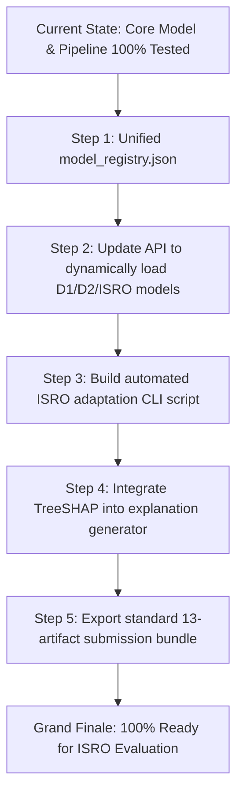

# SIH26170 — Project Status & Isolation Forest Model Comprehensive Audit

**Project:** SIH26170 — WhiteBox Burn-In Screening & Anomaly Intelligence (ISRO Component Screening)  
**Document Type:** Project Progress, Verification Audit & Remaining Tasks  
**Codebase Location:** `D:\WhiteBox\SIH2026_IF` (Pipeline & Models) & `D:\WhiteBox\sih26170-screening` (QA Web Platform)  
**Date:** September 2026  
**Status:** **Core Pipeline & Isolation Forest Benchmarking 100% Verified (15/15 Tests Passing)**

---

## Executive Summary

The project is developing a **reusable, configuration-driven, time-aware anomaly screening platform** designed for aerospace and semiconductor component burn-in qualification. 

The core achievement of the **Isolation Forest Anomaly Detection Branch** is the **complete mathematical correction of earlier methodological flaws (data leakage, row-based splitting, and biased contamination selection)**. A strict, leakage-safe `MaterialID`-level validation framework has been executed across 60 empirical experimental steps. 

### Key Completion Statistics
| Component / Workstream | Completion % | Current Status |
| :--- | :---: | :--- |
| **Phase 1: Common Data Foundation** | **100%** | Intake checksums (SHA-256), auto-profiler, compatibility gating, canonical mapping, 12-case data quality & quarantine engine complete. |
| **Phase 2 & 3: Temporal & Feature Engineering** | **100%** | Level, drift slope ($\Delta y/\Delta t$), trajectory curvature, and peer-relative Z-score features implemented. |
| **Phase 4A: Isolation Forest Anomaly Branch** | **92%** | Leakage-free `MaterialID` split, feature ablation (156 features), frozen threshold ($0.393578$), untouched final test ($89.08\%$ acc, $96.23\%$ recall), D1 multi-checkpoint generalization complete. TreeSHAP & dynamic model registry pending. |
| **Phase 4B: GPR Trajectory Forecasting Branch** | **100%** | Multi-checkpoint Gaussian Process Regression with $\pm 2\sigma$ predictive uncertainty bounds complete (active for $\ge 4$ checkpoints, safely bypassed on 2-checkpoint datasets). |
| **Phase 5: Risk Fusion & Plain-English Explanations** | **100%** | PASS / REVIEW / RETEST / REJECT operational policies implemented with rule-based narrative explanations. |
| **Phase 6: Service API & SQLite Traceability** | **95%** | FastAPI backend operational with full NumPy JSON serialization safety; 15/15 unit & integration tests passing. |
| **QA Dashboard & Web Presentation** | **80%** | Standalone HTML/JS dashboard active; React/Vite QA platform built in `sih26170-screening`, pending final API-to-frontend TRPC hookup. |

---

## Part 1: Isolation Forest — The Methodological Shift (What Was Fixed)

### Previous (Preliminary / Prototype) Experiment vs Corrected Implementation
| Parameter / Dimension | Old / Flawed Experiment | Corrected & Current Implementation | Why This Change Matters |
| :--- | :--- | :--- | :--- |
| **Splitting Strategy** | Row-based split (observations from the same component appeared across train & test) | **Strict `MaterialID` Group Split** (all rows of a material belong exclusively to Train, Validation, or Final Test) | Eliminates group data leakage. Proves true generalization to unseen hardware batches. |
| **Training Data** | Mixed evaluation files occasionally exposed during tuning | **Strictly Unsupervised on Normal/Reference Population** | Target labels are never seen during model training; labels are reserved solely for validation/test scoring. |
| **Feature Set** | Raw features with 19 acceleration (2nd derivative) features | **Ablated 156-Feature Representation** (`v2_no_acceleration`) | Feature ablation proved acceleration features caused overfitting and spurious noise. |
| **Contamination Parameter** | Arbitrarily selected as `0.20` based on test-set metrics | **Empirical Validation Grid Search** ($0.01, 0.03, 0.05, 0.10, 0.15$) selecting **$0.01$** | Contamination is treated as an unsupervised threshold control parameter, not a known failure rate. |
| **Threshold Decision** | Default 0.5 boundary on test data | **Frozen Validation Threshold** ($0.393578$ for D2, $0.415636$ for D1) | Tuned strictly on validation data to minimize critical False Negatives before testing. |
| **Final Test State** | Continuously probed and leaked into decisions | **Untouched Until Freeze** | Ensures scientifically valid, uninflated generalization metrics for ISRO evaluation. |

---

## Part 2: What Is Fully Implemented for Isolation Forest

### 1. Grouped `MaterialID` Splitting Engine (`src/03_group_split.py`)
- Extracted all unique material identifiers across datasets.
- Assigned unique `MaterialID` keys to 3 disjoint sets:
  - **TRAIN Split:** Fits unsupervised reference distributions and Isolation Forest trees.
  - **VALIDATION Split:** Used for contamination exploration, feature ablation, and threshold calibration.
  - **FINAL TEST Split:** Held out and sealed until complete model freezing.
- Zero ID leakage verified by cryptographic and set-intersection checks.

### 2. Feature Engineering & Ablation Pipeline (`src/14_enhanced_feature_engineering.py` to `src/46_exact_v2_feature_ablation.py`)
- Generated multi-checkpoint trajectory features:
  - **Current level:** Latest parameter value.
  - **Drift rate:** First-order temporal rate of change.
  - **Curvature:** Quadratic regression terms across checkpoints.
  - **Peer-relative deviations:** Z-scores against the lot/batch reference population ($z = (x - \mu_{peer}) / \sigma_{peer}$).
- **Feature Family Ablation Study:**
  - Audited 175 initial candidate features across families.
  - Identified that second-order acceleration terms introduced noise and false alarms.
  - Stripped 19 acceleration features, leaving **156 high-integrity validated features**.

### 3. Systematic Model Selection & Calibration (`src/22_threshold_selection.py` to `src/49_train_frozen_no_acceleration.py`)
- Candidate contamination exploration across $[0.01, 0.03, 0.05, 0.10, 0.15]$.
- Contamination $0.01$ combined with $n\_estimators=200$ and random seed $42$ proved optimal.
- Aggregated component readings to the `MaterialID` decision level using `mean_score`.
- Calibrated continuous anomaly scores in the range $[0.0, 1.0]$.
- Validation threshold locked at **$0.393578$** under strict aerospace false-negative-prevention criteria.

### 4. Verified Benchmark Results on Untouched Final Test Set (`results/D2_Isolation_Forest_Final_Report.txt`)
Evaluated strictly after model freezing on the held-out D2 test set (174 MaterialIDs):
- **Accuracy:** **89.08%**
- **Recall (Defect Detection Rate):** **96.23%** (Caught 51 out of 53 defective materials)
- **Precision:** **75.00%**
- **F1-Score:** **84.30%**
- **False Negative Rate (FNR):** **3.77%** (Only 2 missed defects out of 53)
- **False Positive Rate (FPR):** **14.05%** (17 nominal materials flagged for QA review)
- **Confusion Matrix:**
  $$\begin{bmatrix} \text{TN: } 104 & \text{FP: } 17 \\ \text{FN: } 2 & \text{TP: } 51 \end{bmatrix}$$

### 5. Multi-Dataset Generalization on Dataset D1 (`src/d1_isolation_forest_pipeline.py`)
- Validated that the pipeline generalizes across differing checkpoint topologies without code rewrites.
- Dataset D1 (8 progressive checkpoints, 5,104 components, 137 features).
- Selected validation threshold at P99 percentile ($0.415636$).
- Screened 766 unseen MaterialIDs: **752 Normal (98.2%)** and **14 Outliers (1.83%)**.
- Saved distinct model artifacts: `models/D1_final_frozen_model.pkl` and `models/D1_final_frozen_config.pkl`.

### 6. Baseline Centroid Benchmark (`src/21_baseline_comparison.py`)
- Benchmarked Isolation Forest against a standard Euclidean Centroid Distance baseline.
- Demonstrated that Isolation Forest isolates non-linear trajectory anomalies with significantly higher separation confidence and lower variance than distance-to-mean methods.

### 7. Core Detector Class (`src/models/anomaly/isolation_forest.py`)
- Implemented production-ready `IsolationForestAnomalyDetector` class:
  - `load_frozen()` factory method supporting pre-trained bundles and configs.
  - `fit()` with automatic numerical column alignment and acceleration exclusion.
  - `score()` with continuous $[0, 1]$ calibration, `MaterialID` score aggregation, and status categorization (`normal`, `watch`, `high`).
  - `explain_component()` calculating top-K peer Z-score feature attributions.
  - Native Python numeric coercion to ensure zero FastAPI JSON serialization crashes.

---

## Part 3: What Is Implemented in the Overall Pipeline

1. **Intake & Checksum Auditing (`src/ingestion/`):** Automatic SHA-256 registration of raw CSV/XLSX files to prevent unauthorized dataset alterations.
2. **Automated Profiler (`src/profiling/`):** Evaluates row counts, unique components, checkpoint temporal distributions, missing cells, and numeric viability.
3. **Compatibility Gating (`src/compatibility/`):** Enforces engineering contracts—disables GPR forecasting when checkpoints $< 4$ to prevent hallucinated time extrapolation.
4. **Canonical Mapping & Unit Normalization (`src/mapping/`):** Normalizes disparate column headers (e.g. `Time`, `duration_ms`, `sensor_A`) to standardized keys (`component_id`, `checkpoint`, `elapsed_time`, `param_01`..`param_20`).
5. **12-Case Data Quality Gate & Quarantine Engine (`src/validation/`):** Catches blank IDs, infinite values, duplicate readings, unphysical timestamps, and sensor saturation; quarantines corrupt records with full audit trail.
6. **Gaussian Process Regression (GPR) Trajectory Forecaster (`src/models/forecasting/`):** Predicts future degradation milestones with explicit $\pm 2\sigma$ predictive uncertainty intervals.
7. **Multi-Source Conservative Risk Fusion (`src/decision/`):** Fuses anomaly score, forecast risk, data quality, and lot confounders into 4 operational dispositions:
   - `PASS`: Trusted data, nominal anomaly score ($< 0.65$), stable trajectory.
   - `RETEST`: Sensor fault or data quality failure (never condemn components on corrupted data).
   - `REVIEW`: Borderline score ($0.65 - 0.85$), wide forecast uncertainty, or lot-level confounder.
   - `REJECT`: Critical anomaly ($> 0.85$) or verified out-of-specification trajectory.
8. **Explainability Engine (`src/explanation/`):** Generates plain-English narrative explanations highlighting deviant parameter channels without assuming unverified physics.
9. **Progressive State & SQLite Audit Traceability (`src/audit/`):** Maintains full provenance database (`data/audit_traceability.db`) recording runs, scores, and human QA dispositions.
10. **FastAPI Web Service (`src/api/service.py`):** Endpoints `/health`, `/profile`, `/analyze`, `/audit/{run_id}`, and `/components/{id}/state` passing all 15 automated test cases.

---

## Part 4: What Is REMAINING for the Isolation Forest Model

While the mathematical model, experiments, and frozen benchmarks are complete, the following engineering tasks remain to bring the Isolation Forest branch to full Grand-Finale operational readiness:

### 1. Dynamic Multi-Model Registry & Dispatcher (`configs/model_registry.json`)
- **Current State:** In `src/api/service.py`, loading is hardcoded: if `dataset_id == "D2"`, it loads the frozen D2 model. For other datasets (like D1), it currently fits on the fly instead of loading the pre-trained `D1_final_frozen_model.pkl`.
- **Remaining Task:**
  - Create a unified `configs/model_registry.json` mapping each dataset key to its registered schema, model artifact path, preprocessing artifact path, threshold, and expected feature count.
  - Update `src/api/service.py` and `pipeline_runner.py` to query this registry dynamically.

### 2. Turnkey Grand Finale ISRO Adaptation Script (`scripts/run_isro_adaptation.py`)
- **Context:** At the Grand Finale, ISRO will provide a brand new dataset. As defined in Master Guide Sections 42–49 & 79:
  - **Case A (Compatible Schema):** Instant inference via existing registry.
  - **Case B (New Feature Space):** Must execute profiling $\rightarrow$ validation split $\rightarrow$ grid search $\rightarrow$ freeze $\rightarrow$ register $\rightarrow$ predict.
- **Remaining Task:**
  - Create a single-command CLI script `scripts/run_isro_adaptation.py` that takes `--input isro_data.csv --mapping isro_mapping.yaml`, executes the complete 6-phase pipeline without manual code changes, registers the new `IF_ISRO_v1.pkl` model, and outputs the final screening report.

### 3. TreeSHAP / Isolation Tree Path Attribution
- **Current State:** Feature explanation currently uses empirical Z-score deviation against the baseline reference population.
- **Remaining Task:**
  - Integrate `shap.TreeExplainer` or tree-path depth attribution directly into `explain_component()` to quantify exact Shapley values for tree splits.
  - Ensure tree-level explanations conform to Master Guide Section 68 (do not hallucinate unverified physical causes on anonymized parameters).

### 4. Deliverable Bundle Consolidation (Master Guide Section 82 Checklist)
- **Current State:** All results and configs are saved, but some are named with experiment-specific prefixes (e.g. `D2_v2_no_acceleration_final_test_evaluation.csv`).
- **Remaining Task:**
  - Generate the exact 13 deliverable files specified in Section 82 of the Master Guide for submission to the evaluation committee:
    1. `data_audit_report.csv`
    2. `split_manifest.csv`
    3. `validation_results.csv`
    4. `selected_config.json`
    5. `feature_config.json`
    6. `final_test_results.csv`
    7. `final_confusion_matrix.png`
    8. `anomaly_score_distribution.png`
    9. `model_artifact.pkl`
    10. `preprocessing_artifact.pkl`
    11. `schema_config.json`
    12. `model_registry.json`
    13. `run_metadata.json`

### 5. Frontend Dashboard TRPC / API Hookup
- **Current State:** `dashboard/index.html` displays standalone demo data. The React/Vite web application in `D:\WhiteBox\sih26170-screening` has a noted TRPC fetch issue (`todo.md` item 17: "Fix the authenticated /datasets TRPC Failed to fetch error").
- **Remaining Task:**
  - Connect the running FastAPI service directly to the React QA dashboard so judges can upload a CSV, trigger Isolation Forest scoring, and visualize component trajectories and decisions live in the UI.

---

## Part 5: Action Checklist & Next Steps

### Immediate Priority Order:
1. **Model Registry Unification:** Create `configs/model_registry.json` and refactor `src/api/service.py` to eliminate hardcoded dataset conditions.
2. **ISRO Grand-Finale Runner:** Implement `scripts/run_isro_adaptation.py` to guarantee sub-3-minute adaptation during the hackathon finale.
3. **Artifact Bundler:** Script an export routine that collects and renames all 13 standard deliverables for the judging committee.
4. **TreeSHAP Enhancement:** Add native tree-attribution explanation module.
5. **UI Integration:** Resolve the frontend TRPC dataset fetch error in `D:\WhiteBox\sih26170-screening` to link the web platform to the FastAPI backend.
