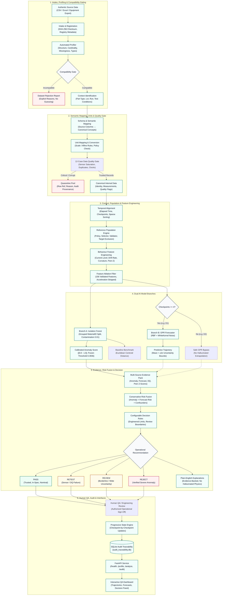

# AI-Driven Burn-In Screening & Anomaly Detection (SIH26170) — Process Flow Diagram

---

## Mermaid Source Code

```mermaid
flowchart TD
    %% -------------------------------------------------------------
    %% STAGE 1: INGESTION, PROFILING & COMPATIBILITY GATING
    %% -------------------------------------------------------------
    subgraph S1 ["1. Intake, Profiling & Compatibility Gating"]
        A["Authentic Source Data<br/>(CSV / Excel / Equipment Export)"] --> B["Intake & Registration<br/>(SHA-256 Checksum, Registry Metadata)"]
        B --> C["Automated Profiler<br/>(Structure, Cardinality, Missingness, Types)"]
        C --> D{"Compatibility Gate"}
        D -- "Incompatible" --> D_REJ["Dataset Rejection Report<br/>(Explicit Reasons, No Guessing)"]
        D -- "Compatible" --> E["Context Identification<br/>(Part Type, Lot, Run, Test Conditions)"]
    end

    %% -------------------------------------------------------------
    %% STAGE 2: MAPPING, UNITS & 12-CASE QUALITY GATE
    %% -------------------------------------------------------------
    subgraph S2 ["2. Semantic Mapping, Units & Quality Gate"]
        E --> F["Schema & Semantic Mapping<br/>(Source Columns → Canonical Concepts)"]
        F --> G["Unit Mapping & Conversion<br/>(Scale / Affine Rules, Policy Check)"]
        G --> H["12-Case Data Quality Gate<br/>(Sensor Saturation, Duplicates, Clocks)"]
        H -- "Critical / Corrupt" --> H_Q["Quarantine Pool<br/>(Row Ref, Reason, Audit Provenance)"]
        H -- "Trusted Records" --> I["Canonical Internal Data<br/>(Identity, Measurements, Quality Flags)"]
    end

    %% -------------------------------------------------------------
    %% STAGE 3: POPULATION & BEHAVIOUR ENGINEERING
    %% -------------------------------------------------------------
    subgraph S3 ["3. Context, Population & Feature Engineering"]
        I --> J["Temporal Alignment<br/>(Elapsed Time, Checkpoints, Sparse Sorting)"]
        J --> K["Reference Population Engine<br/>(Policy, Selector, Validator, Target Exclusion)"]
        K --> L["Behaviour Feature Engineering<br/>(Current Level, Drift Rate, Curvature, Peer-Z)"]
        L --> M["Feature Ablation Filter<br/>(156 Validated Features, Acceleration Stripped)"]
    end

    %% -------------------------------------------------------------
    %% STAGE 4: DUAL AI MODEL BRANCHES
    %% -------------------------------------------------------------
    subgraph S4 ["4. Dual AI Model Branches"]
        M --> N1["Branch A: Isolation Forest<br/>(Grouped MaterialID Split, Contamination 0.01)"]
        N1 --> O1["Calibrated Anomaly Score<br/>([0.0 - 1.0], Frozen Threshold 0.3936)"]
        N1 --> O1_BASE["Baseline Benchmark<br/>(Euclidean Centroid Distance)"]

        M --> N2{"Checkpoints >= 4?"}
        N2 -- "Yes (e.g. D1)" --> P1["Branch B: GPR Forecaster<br/>(RBF + WhiteKernel Noise)"]
        P1 --> P2["Predictive Trajectory<br/>(Mean + ±2σ Uncertainty Bounds)"]
        N2 -- "No (e.g. D2)" --> P3["Safe GPR Bypass<br/>(No Hallucinated Extrapolation)"]
    end

    %% -------------------------------------------------------------
    %% STAGE 5: EVIDENCE, RISK FUSION & OPERATIONAL DECISION
    %% -------------------------------------------------------------
    subgraph S5 ["5. Evidence, Risk Fusion & Decision"]
        O1 --> Q["Multi-Source Evidence Pack<br/>(Anomaly, Forecast, DQ, Peer Z-Scores)"]
        P2 -.-> Q
        P3 -.-> Q
        
        Q --> R["Conservative Risk Fusion<br/>(Anomaly + Forecast Risk + Confounders)"]
        R --> S["Configurable Decision Rules<br/>(Engineered Limits, Review Boundaries)"]
        S --> T{"Operational Recommendation"}
        
        T --> T1["PASS<br/>(Trusted, In-Spec, Nominal)"]
        T --> T2["RETEST<br/>(Sensor / DQ Failure)"]
        T --> T3["REVIEW<br/>(Borderline / Wide Uncertainty)"]
        T --> T4["REJECT<br/>(Verified Severe Anomaly)"]

        T --> U["Plain-English Explanations<br/>(Evidence-Backed, No Hallucinated Physics)"]
    end

    %% -------------------------------------------------------------
    %% STAGE 6: HUMAN QA, AUDIT & INTERFACES
    %% -------------------------------------------------------------
    subgraph S6 ["6. Human QA, Audit & Interfaces"]
        T1 & T2 & T3 & T4 --> V["Human QA / Engineering Review<br/>(Authorized Operational Sign-Off)"]
        V --> W["Progressive State Engine<br/>(Checkpoint-by-Checkpoint Updates)"]
        W --> X[("SQLite Audit Traceability<br/>(audit_traceability.db)")]
        
        X --> Y["FastAPI Service<br/>(/health, /profile, /analyze, /audit)"]
        Y --> Z["Interactive QA Dashboard<br/>(Trajectories, Forecasts, Decision Panel)"]
    end

    %% Styling
    classDef primary fill:#f0fdfa,stroke:#0f766e,stroke-width:1.5px,color:#0f172a;
    classDef warning fill:#fffbeb,stroke:#b45309,stroke-width:1.5px,color:#0f172a;
    classDef danger fill:#fff1f2,stroke:#be123c,stroke-width:1.5px,color:#0f172a;
    classDef success fill:#ecfdf5,stroke:#047857,stroke-width:1.5px,color:#0f172a;
    classDef neutral fill:#f8fafc,stroke:#475569,stroke-width:1.5px,color:#0f172a;

    class A,B,C,E,F,G,I,J,K,L,M,N1,O1,P1,P2,Q,R,S,U,W,X,Y,Z primary;
    class D,N2,T neutral;
    class D_REJ,H_Q,T4 danger;
    class T2,T3 warning;
    class T1 success;
```
