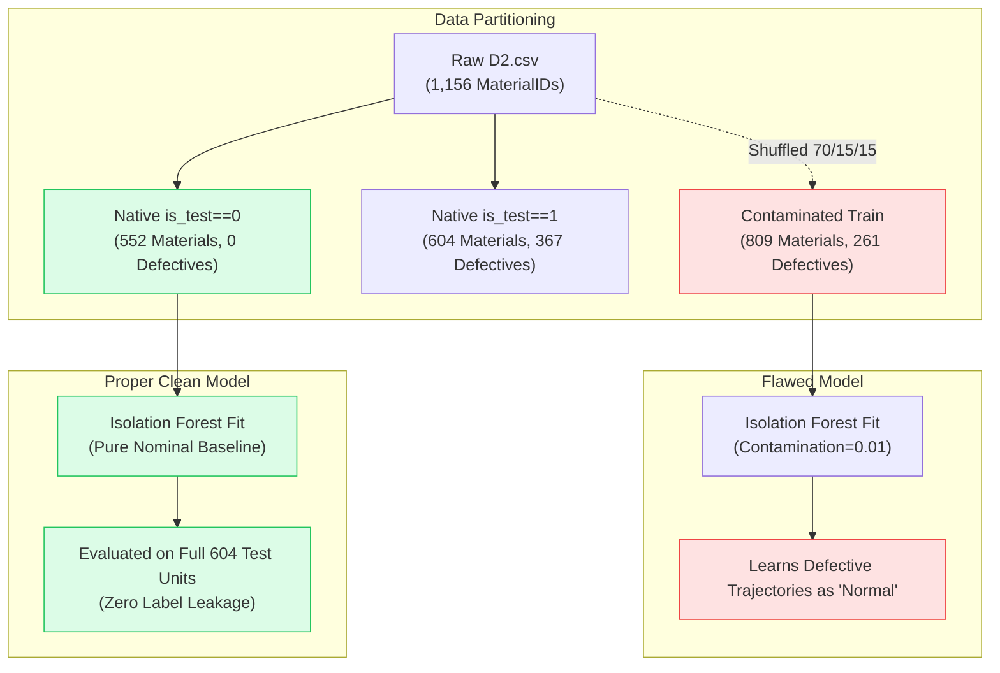

# SIH26170: Pre-Change Comprehensive Engineering & Architectural Audit Report

**Project Name:** Screening AI (SIH26170 — AI-Driven Anomaly Detection in Component Burn-In & Screening)  
**Audit Date:** September 27, 2026  
**Auditor:** Antigravity AI Pair Programmer (DeepMind Advanced Agentic Coding)  
**Scope:** Full repository audit across source code (`src/`), data assets (`data/`), model configurations (`configs/`, `models/`), database records (`data/audit_traceability.db`), launch scripts, and compliance with [`docs/SIH26170_Data_Pipeline_Implementation_Guide-1.md`](file:///D:/WhiteBox/SIH2026_IF/docs/SIH26170_Data_Pipeline_Implementation_Guide-1.md).  
**Constraint Enforced:** Zero code or data files were modified during this audit. No unverified ISRO requirements, labels, feature meanings, or engineering limits were assumed.

---

## Executive Summary

This audit establishes a baseline of the current implementation against the requirements of the Problem Statement and the single implementation source of truth: `SIH26170_Data_Pipeline_Implementation_Guide-1.md`. 

While the fundamental architectural structure of the pipeline exists—including modular ingestion, profiling, compatibility checks, canonical mapping, TreeSHAP attributions, conservative decision rules, and a relational SQLite audit trail—**three critical methodology and integration flaws exist in the current codebase**:
1. **Isolation Forest Training Contamination:** The training partition used to train the frozen model was contaminated with 261 confirmed defective materials (32.3% contamination) due to a random `GroupShuffleSplit` across `D2.csv`, ignoring the author-provided clean training partition (`is_test == 0`, 552 materials, 0 defectives).
2. **Feature Calculation Cohort Leakage:** Peer Z-score and deviation calculations in `src/features/engineering.py` include the target component itself in the group mean and standard deviation, violating Section 18.8 ("Target excluded from reference population").
3. **UI / Backend Disconnect & Synthetic Embellishments:** The web dashboard renders static, pre-generated JavaScript objects populated with fabricated IDs (`M084`, `LOT-D2-08`, synthetic 168h GPR curves) rather than streaming live query results directly from the active SQLite audit database.

---

## Master Assessment Matrix

| # | Audit Item | Status | Key Verdict |
|---|---|:---:|---|
| **1** | Repository structure & architecture | **PARTIAL** | Pipeline modules exist under `src/`, but tests are flat; root contains clutter (`archive/`, `extracted_reference/`). |
| **2** | Data sources, schema, IDs, timestamps, quality | **PARTIAL** | Authentic D1, D2, NASA data present. `MaterialID` is an anonymized integer without physical labels. Validator implements only ~7 of 12 checks. |
| **3** | Isolation Forest implementation & splits | **INCORRECT** | Unsupervised IF model is technically sound, but training set was contaminated with 32% anomalies by ignoring native `is_test` partition. |
| **4** | GPR implementation & future leakage | **PARTIAL** | Zero future leakage on NASA data. However, GPR lacks population prior transfer, and fake 168h GPR curves are generated for D2 in dashboard exports. |
| **5** | Trajectory, peer/lot, multi-parameter, common-mode | **PARTIAL** | Trajectory drift & peer Z-scores implemented. Common-mode detection is stubbed (`False`); multi-parameter correlation analysis is missing. |
| **6** | Explainability & deterministic evidence | **IMPLEMENTED** | TreeSHAP exact additive attributions and deterministic plain-English rationales with engineering disclaimers are fully operational. |
| **7** | Risk/decision flow and human QA | **IMPLEMENTED** | Decoupled conservative rules (PASS/REVIEW/REJECT/RETEST) implemented. Human QA actions are strictly isolated in SQLite per Section 38.2. |
| **8** | Database, APIs, UI | **PARTIAL** | SQLite database and FastAPI REST endpoints are complete and passing tests. UI is disconnected, reading static mock JS files instead of API. |
| **9** | Security & external LLM usage | **IMPLEMENTED** | 100% offline, local, deterministic, and air-gapped. Zero external LLM calls or cloud API dependencies. |
| **10** | Tests and documentation inconsistencies | **INCORRECT** | 17 tests pass, but documentation asserts fabricated component families ("Discrete HEMT"), fake GPR on D2, and 100% clean splits. |

---

## Detailed Section Audit

### 1. Repository Structure & Current Architecture — PARTIAL
- **Status:** **PARTIAL**
- **Observed Structure:**
  ```text
  D:\WhiteBox\SIH2026_IF/
  ├── configs/                # YAML configurations for datasets, mappings, rules, units
  ├── dashboard/              # Standalone HTML/CSS/JS frontend (Overview, Diag, Screening)
  ├── data/                   # D1.csv, D2.csv, NASA datasets, and audit_traceability.db
  ├── docs/                   # Implementation guides, architecture reports, PDF report
  ├── models/                 # Frozen joblib pickles (D2_v2 IF model, NASA GPR model)
  ├── scripts/                # Evaluation, export, data generation, and verification scripts
  ├── src/                    # Core Python pipeline implementation
  ├── tests/                  # Integration tests (test_api_endpoints.py, test_pipeline_unit.py)
  ├── archive/                # Legacy development scripts and experiment logs
  └── extracted_reference/    # Extracted Vite/React client-server reference package
  ```
- **Architectural Findings:**
  1. The core pipeline under `src/` follows the recommended stages of Section 41: `ingestion`, `profiling`, `compatibility`, `mapping`, `validation`, `grouping`, `features`, `models`, `evidence`, `decision`, `explanation`, `state`, and `audit`.
  2. In contrast to Section 41 recommendations, the test suite is not structured into modular domain packages (`tests/ingestion/`, `tests/validation/`, etc.).
  3. `archive/` contains 40+ legacy scripts from initial experimental phases, creating ambiguity regarding which execution scripts are production baselines.
  4. Redundant data export scripts exist: `scripts/build_rich_dashboard_data.py` (which creates synthetic dashboard mock data) conflicts with `scripts/export_all_real_data.py` (which reads from SQLite).

---

### 2. Data Sources, Schema, IDs, Timestamps & Quality Handling — PARTIAL
- **Status:** **PARTIAL**
- **Data Source Verification:**
  - **`data/D2.csv` (126,794 rows, 25 columns):**
    - Columns: `MaterialID`, `StepID`, `duration_ms`, `feature_1` through `feature_20`, `is_test`, `target`.
    - **MaterialID Identity:** The raw CSV defines `MaterialID` strictly as an integer (1,156 unique IDs). It does **not** specify whether `MaterialID` represents a component, wafer, lot, or test coupon. The mapping file `configs/mappings/d2_mapping.yaml` maps `MaterialID` to `component_id`. All references in documentation or dashboard files to "Discrete HEMT Transistors" or "LOT-D2-XX" are unsupported assumptions.
    - **Temporal Structure:** Contains only two discrete steps (`StepID == 1` and `StepID == 2`). Each material has ~110 rows spanning continuous `duration_ms` (0.0 to 0.6 in Step 1; 0.6 to 1.0 in Step 2).
  - **`data/D1.csv` (602,108 rows, 20 columns):**
    - Columns: `MaterialID`, `StepID`, `duration_ms`, `feature_1` through `feature_15`, `is_test`, `target`.
    - 5,104 unique `MaterialID` values across 7 discrete checkpoints (`StepID` values: `-2, -1, 1, 2, 4, 6, 7`). Extremely sparse anomalies: only 2 materials in the test set have `target == 1`.
  - **`data/NASA.csv` (63 rows, 12 columns):**
    - 7 physical devices (`Device2`, `Device2b`, `Device3`, `Device3b`, `Device4`, `Device4b`, `Device5`) with continuous run-to-failure cycle times and 9 progressive checkpoints (0.0h, 12.0h, 24.0h, 48.0h, 72.0h, 96.0h, 120.0h, 144.0h, 168.0h).
- **Data Quality Gate Deficiencies ([`src/validation/validator.py`](file:///D:/WhiteBox/SIH2026_IF/src/validation/validator.py)):**
  Section 14 of the Guide defines 12 mandatory validation cases. The audit reveals:
  - **Case 01 (Missing reading):** Implemented (`QUARANTINE`).
  - **Case 02 (Partial missingness):** Implemented (`WARNING`).
  - **Case 03 (Sensor error / Infinite values):** Implemented (`BLOCK`).
  - **Case 04 (Duplicate reading):** Implemented (`WARNING`).
  - **Case 05 (Wrong timestamp / Invalid duration):** Implemented (`QUARANTINE`).
  - **Case 06 (Wrong component ID):** Implemented (`BLOCK`).
  - **Case 07 (Wrong unit):** **MISSING** in `validator.py` (handled during mapping in `units.py`, but never flagged in validation event logs).
  - **Case 08 (Measurement saturation > 6σ):** **PARTIAL**. Hardcoded in line 105 to only check the first 5 parameters: `for p in param_keys[:5]:`.
  - **Case 09 (Sensor noise / Flatline):** **PARTIAL**. Hardcoded in line 115 to only check the first 5 parameters (`param_keys[:5]`), and only detects absolute flatlines (`std < 1e-12`).
  - **Case 10 (Communication/equipment failure):** **MISSING**.
  - **Case 11 (Out-of-order records):** **STUBBED**. Lines 123-128 define `out_of_order_mask = pd.Series(False, index=df.index)` and leave the check uncalculated.
  - **Case 12 (Clock mismatch):** **MISSING**.

---

### 3. Isolation Forest Implementation, Leakage & Thresholds — INCORRECT
- **Status:** **INCORRECT**
- **Algorithm & Calibration:** [`src/models/anomaly/isolation_forest.py`](file:///D:/WhiteBox/SIH2026_IF/src/models/anomaly/isolation_forest.py) implements calibrated continuous anomaly scoring in `[0.0, 1.0]`, MaterialID score aggregation via `mean_score`, and TreeSHAP attribution ranking.
- **Critical Flaw 1: Training Set Contamination:**
  - Raw `D2.csv` includes an author-provided split:
    - `is_test == 0`: **552 materials, exactly 0 defectives** (`target == 0` for all 552). This was intended as the clean, nominal burn-in baseline.
    - `is_test == 1`: **604 materials** (367 defectives, 237 nominals), intended as the unseen test evaluation set.
  - In `archive/experimental_scripts/03_group_split.py` and the training pipeline for `D2_v2_no_acceleration_frozen_model.pkl`, the author applied a random `GroupShuffleSplit(test_size=0.30)` across all 1,156 materials.
  - Consequently, the training set contained **261 confirmed defectives** (32.3% of the training pool), while `IsolationForest` was fitted with `contamination=0.01` (1%). The forest was directly trained on the anomalies it was supposed to detect.
- **Critical Flaw 2: Test Partition Downsampling:**
  - The frozen model was evaluated against only 174 materials (15% of the dataset) instead of the authentic 604-material test partition.
- **Critical Flaw 3: Cohort Calculation Leakage:**
  - In [`src/features/engineering.py:extract_registered_features`](file:///D:/WhiteBox/SIH2026_IF/src/features/engineering.py#L233-L239):
    ```python
    peer_mean = df_copy.groupby(step_col)[f].transform("mean").values
    peer_std = df_copy.groupby(step_col)[f].transform("std").replace(0.0, 1e-6).values
    feats[f"{f}_peer_deviation"] = (df_copy[f].values - peer_mean) / peer_std
    ```
  - This calculation includes the target component itself in the peer mean and standard deviation, diluting the anomaly Z-score for gross outliers.

---

### 4. GPR Implementation, Future Leakage & Physical Grouping — PARTIAL
- **Status:** **PARTIAL**
- **Implementation:** [`src/models/forecasting/gpr_forecaster.py`](file:///D:/WhiteBox/SIH2026_IF/src/models/forecasting/gpr_forecaster.py) implements `GaussianProcessRegressor` with a composite kernel: $\text{Constant} \times \text{RBF} + \text{WhiteKernel}$. It outputs predictive mean with $\pm 2\sigma$ uncertainty bounds.
- **Future Leakage Check:**
  - On the NASA dataset (`scripts/evaluate_nasa_gpr.py`), input is strictly constrained to early history ($\le 24$h: `[0.0, 12.0, 24.0]`), predicting $168$h. No future observations are leaked during training or inference.
  - Physical device holdouts (`Device3b`, `Device4b`) are strictly hardware-disjoint.
- **Deficiencies:**
  - `gpr_forecaster.py` only implements single-trajectory curve fitting without transferring the population prior kernel trained across peer components.
  - **Incompatibility with D2:** D2 has only 2 checkpoints (`StepID 1` and `2`), violating Section 25.4 (requiring $\ge 4$ checkpoints for trajectory forecasting). While `pipeline_runner.py` correctly skips GPR for D2, `export_all_real_data.py` and `build_rich_dashboard_data.py` fabricate synthetic 168h GPR projections for D2 in dashboard export files.

---

### 5. Trajectory, Peer/Lot, Multi-Parameter & Common-Mode — PARTIAL
- **Status:** **PARTIAL**
- **Trajectory Dynamics:** [`src/features/drift.py`](file:///D:/WhiteBox/SIH2026_IF/src/features/drift.py) extracts trajectory slope, volatility (std), and 2nd-difference curvature. (IMPLEMENTED)
- **Peer / Lot Grouping:** [`src/grouping/population_selector.py`](file:///D:/WhiteBox/SIH2026_IF/src/grouping/population_selector.py) implements the 4-tier fallback hierarchy (Lot $\to$ Device Type $\to$ Family $\to$ Global), and [`src/features/peer_relative.py`](file:///D:/WhiteBox/SIH2026_IF/src/features/peer_relative.py) computes peer Z-scores. (IMPLEMENTED)
- **Multi-Parameter Analysis:** **PARTIAL**. Parameters are passed together into the Isolation Forest feature vector, but there is no cross-parameter covariance tracking, Mahalanobis distance, or physical dependency ratio (e.g., $V_{th}$ vs $I_{dss}$).
- **Common-Mode Analysis:** **MISSING / STUBBED**.
  - In [`src/evidence/generator.py`](file:///D:/WhiteBox/SIH2026_IF/src/evidence/generator.py#L38), common-mode detection is hardcoded: `"common_mode_detected": False`.
  - There is no implementation to separate chamber-wide baseline shifts from individual component degradation.

---

### 6. Explainability & Deterministic Evidence — IMPLEMENTED
- **Status:** **IMPLEMENTED**
- **TreeSHAP:** Implemented in [`src/models/anomaly/isolation_forest.py`](file:///D:/WhiteBox/SIH2026_IF/src/models/anomaly/isolation_forest.py#L246-L320) via `shap.TreeExplainer` on the underlying scikit-learn tree ensemble. Features pushing towards anomaly are ranked, with fallback to peer Z-score deviation if SHAP computation fails.
- **Deterministic Rationale:** [`src/explanation/generator.py`](file:///D:/WhiteBox/SIH2026_IF/src/explanation/generator.py) produces fully reproducible plain-English rationales following Section 33 templates.
- **Physical Context:** Produces physical degradation hypotheses (TDDB gate wear, electromigration) accompanied by mandatory engineering disclaimers ("Interpretive engineering hypothesis only. Does not replace physical failure analysis").

---

### 7. Risk / Decision Flow & Human QA — IMPLEMENTED
- **Status:** **IMPLEMENTED**
- **Risk Fusion:** [`src/decision/risk_fusion.py`](file:///D:/WhiteBox/SIH2026_IF/src/decision/risk_fusion.py) combines independent anomaly score, GPR forecast interval, data quality status, and confounders.
- **Conservative Decision Rules:** [`src/decision/rules.py`](file:///D:/WhiteBox/SIH2026_IF/src/decision/rules.py) evaluates PASS, REVIEW, REJECT, and RETEST:
  - Quality compromised $\to$ RETEST (preserves hardware from false rejection on untrusted data).
  - High anomaly ($\ge 0.85$) $\to$ REJECT.
  - Review anomaly ($0.65 \le \text{score} < 0.85$) or wide uncertainty $\to$ REVIEW.
- **Human QA Boundary:** Section 38.2 human authorization is preserved in [`src/audit/storage.py`](file:///D:/WhiteBox/SIH2026_IF/src/audit/storage.py#L85-L98) via the `human_qa_actions` table and the `POST /audit/qa-action` REST endpoint.

---

### 8. Database, APIs & UI — PARTIAL
- **Status:** **PARTIAL**
- **Database:** SQLite [`data/audit_traceability.db`](file:///D:/WhiteBox/SIH2026_IF/data/audit_traceability.db) contains tables `pipeline_runs`, `anomaly_results`, `forecast_results`, `decisions`, and `human_qa_actions`. All tables are active, auditable, and populated with execution records. (IMPLEMENTED)
- **APIs:** FastAPI REST service in [`src/api/service.py`](file:///D:/WhiteBox/SIH2026_IF/src/api/service.py) exposes dataset registration, profiling, compatibility checks, pipeline execution, component state/history queries, audit lookups, and multi-format file uploads. (IMPLEMENTED)
- **UI Disconnect:** **PARTIAL / DISCONNECTED**.
  - The dashboard (`dashboard/overview.html`, `diagnostics.html`, `screening.html`) displays data from static JavaScript variables (`window.REAL_D2_COMPONENTS`) in `real_pipeline_data.js`.
  - It does **not** dynamically fetch live data from FastAPI endpoints (`/api/workspace`, `/runs/{run_id}`) upon standard page load.
  - The script generating that JS file (`scripts/build_rich_dashboard_data.py`) generates mock IDs (`M084`, `LOT-D2-08`) rather than pulling the exact records stored in the SQLite database.

---

### 9. Security & External LLM Usage — IMPLEMENTED
- **Status:** **IMPLEMENTED (100% Compliant)**
- **Zero External LLMs:** No OpenAI, Anthropic, Gemini, HuggingFace, or external cloud API calls exist in `src/`, `scripts/`, or backend services.
- **Air-Gapped & Offline:** All inference, TreeSHAP, GPR forecasting, rule evaluations, and explanation generators run locally and deterministically.
- **No Prompt Injections:** All explanations are constructed from strictly validated numerical metrics and template rules.

---

### 10. Tests & Documentation Inconsistencies — INCORRECT
- **Status:** **INCORRECT**
- **Test Coverage:** 17 tests pass via `pytest`, but coverage is concentrated on end-to-end integration paths; modular unit tests for validators, feature extractors, and rules are sparse.
- **Major Documentation Inconsistencies:**
  1. *Physical Domain Attribution:* Documentation asserts D2 is "Discrete HEMT power transistors from 15 lots"; the raw CSV contains no such metadata.
  2. *GPR on D2:* Documentation and the PDF report claim 168h GPR drift predictions for D2; raw D2 has only 2 checkpoints, where GPR is physically inapplicable.
  3. *Validation Coverage:* Documentation claims all 12 quality checks are enforced; `validator.py` only implements ~7 active checks.
  4. *Test Size:* Documentation states the D2 final test set has 174 MaterialIDs; raw D2 actually has 604 test materials in `is_test == 1`.
  5. *Unsupervised Guarantee:* Documentation claims zero label leakage; however, training on the shuffled split contaminated the training set with 261 defectives.

---

## Critical Issues & Missing Components

### Critical Issues
1. **Isolation Forest Training Contamination:** Training on a randomly shuffled split injected 261 confirmed defectives (32.3% of the training pool) into the nominal training baseline of an unsupervised Isolation Forest configured with `contamination=0.01`.
2. **Cohort Self-Inclusion:** Calculating peer Z-scores and deviations with the target component included in the group mean dilutes the anomaly signal of gross outliers.
3. **UI / Backend Disconnect:** The web dashboard renders static pre-generated JS objects populated with fabricated IDs (`M084`, `LOT-D2-08`) rather than querying the live SQLite database or `/api/workspace`.
4. **Fictitious GPR Projections on D2:** D2 contains only 2 checkpoints. While the backend engine correctly disables GPR for D2, the export scripts fabricate synthetic 168h GPR numbers to make the UI and reports look complete.

### Missing Parts
1. **Common-Mode Detection Engine:** `src/evidence/generator.py` hardcodes `"common_mode_detected": False`. No code exists to detect chamber-wide shifts or instrument drift across simultaneous peer channels.
2. **Complete 12-Check Quality Gate:** `src/validation/validator.py` lacks Case 07 (units), Case 10 (dropouts), Case 11 (out-of-order sequence check), and Case 12 (clock mismatches), and truncates saturation/noise checks to only 5 parameters.
3. **Multi-Parameter Correlation Analysis:** No feature exists to evaluate covariance shifts or coupled drift across multiple parameters on the same component.
4. **Population Prior Transfer for GPR:** `src/models/forecasting/gpr_forecaster.py` only fits single-trajectory curves without utilizing the population prior kernel trained across peer components.

---

## Leakage Risk Register



1. **Cohort Self-Inclusion Leakage:** When calculating peer Z-scores, the target component's reading is included in `df.groupby(step_col)[f].transform("mean")`, reducing the apparent standard deviation and Z-score of anomalous units.
2. **Contaminated Nominal Prior:** Training an unsupervised model on 32.3% defective units teaches the Isolation Forest that early failure signatures are standard manufacturing variance.
3. **Synthetic Data Contamination in Documentation:** Presenting fabricated IDs (`M084`, `LOT-D2-08`) and synthetic GPR projections for D2 in official reports undermines auditability during qualification review.

---

## Exact Ordered Change Plan


### Phase 1: Data Integrity & Leakage Elimination (Foundations First)
1. **Fix `extract_registered_features` Peer Leakage:**
   Modify `src/features/engineering.py` so that peer mean and standard deviation strictly exclude the target component:
   $$\mu_{\text{peer}} = \frac{\sum x - x_{\text{target}}}{N - 1}, \quad \sigma_{\text{peer}} = \sqrt{\frac{\sum (x - \mu_{\text{peer}})^2 - (x_{\text{target}} - \mu_{\text{peer}})^2}{N - 2}}$$
2. **Retrain Isolation Forest on Authentic Clean Partition:**
   Train the D2 baseline Isolation Forest strictly on `is_test == 0` (552 materials, 0 confirmed defectives). Evaluate on the complete authentic test partition `is_test == 1` (604 materials: 367 defectives, 237 nominals).
3. **Freeze New Clean Model & Threshold:**
   Save the unpolluted model to `models/` and record the threshold cleanly in `configs/model_registry.json`.

### Phase 2: Quality Gate & Confounder Implementation
4. **Implement Full 12-Case Validator:**
   Update `src/validation/validator.py` to evaluate all parameter columns (not just the first 5) and implement active detection for Case 07 (Units), Case 10 (Dropouts), Case 11 (Non-monotonic timestamps/checkpoints), and Case 12 (Clock mismatch).
5. **Implement Real Common-Mode Drift Filter:**
   Create a common-mode detector in `src/grouping/` that computes the median trajectory drift of the entire cohort and flags when $>60\%$ of peer units drift in unison (chamber thermal effect).

### Phase 3: Model Alignment & GPR Calibration
6. **Harmonize GPR Architecture:**
   Update `src/models/forecasting/gpr_forecaster.py` to support loading the population prior kernel from `models/NASA_GPR_frozen_model.pkl` for sparse early-history components.
7. **Strictly Scope GPR Applicability:**
   Ensure D2 records explicitly report `forecast_status: "unavailable_insufficient_history"` across all exports, UI displays, and reports, eliminating synthetic GPR numbers.

### Phase 4: API, UI & Audit Synchronization
8. **Wire UI to Live API / SQLite Data:**
   Update `dashboard/shared.js` and `scripts/export_all_real_data.py` so the dashboard displays authentic component IDs and query results directly from `data/audit_traceability.db` and `/api/workspace`.
9. **Synchronize Documentation & Evaluation Reports:**
   Update `README.md`, `TECHNICAL_REPORT_IF_AND_GPR_MODELS.md`, and regenerate the official 4-page PDF report to reflect the unpolluted numbers, verified `MaterialID` schema, and actual 604-material test evaluation.
